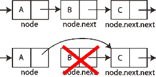

# JavaScript 中的链表

链表是一种数据结构，以线性方式存储多个值。链表中的每个值都包含在其自己的节点中，该对象包含数据以及指向列表中下一个节点的链接。链接是指向另一个节点对象的指针，如果没有下一个节点，链接指向 null。如果每个节点只有一个指向另一个节点的指针（最常称为 next ），则该列表被认为是单向链表（or just linked list），而如果每个节点有两个链接（通常是 previous 和 next），则它被认为是双向链表。在这篇文章中，我主要学习单向链表。

## 为什么要使用链表？

链表的主要好处是它们可以包含任意数量的值，同时只使用这些值所需的内存量。在内存稀缺的旧计算机上，保留内存非常重要。当时，C 中的内置数组要求您指定该数组可以包含多少项，并且程序将保留该数量的内存。保留该内存意味着它不能用于程序的其余部分或同时运行的任何其他程序，即使内存从未被填满。在一台内存稀缺的机器上，您可以使用数组轻松耗尽可用内存。创建链接列表是为了解决此问题。

虽然最初是为了更好的内存管理，但当开发人员不知道数组最终包含多少项时，链表也变得流行起来。使用链表并根据需要添加值比准确猜测数组可能包含的最大值数要容易得多。因此，链表通常被用作各种编程语言中内置数据结构的基础。

内置的 JavaScript Array 类型没有实现为链表，尽管它的大小是动态的，但始终是最好的选择。你可能在整个职业生涯中都不需要在 JavaScript 中使用链表，但链表仍然是学习创建自己的数据结构的好方法。

## 设计一个链表

链表最重要的部分是它的节点结构。每个节点必须包含一些数据和指向列表中下一个节点的指针。这是 JavaScript 中的一个简单表示：

```js
class LinkedListNode {
  constructor(data) {
    this.data = data
    this.next = null
  }
}
```

在 LinkedListNode 类中，该 data 属性包含链接列表项应存储的值，该 next 属性是指向列表中下一项的指针。该 next 属性开始是 null 因为您还不知道下一个节点。然后，您可以使用这样的 LinkedListNode 类创建一个链表：

```js
// create the first node
const head = new LinkedListNode(12)

// add a second node
head.next = new LinkedListNode(99)

// add a third node
head.next.next = new LinkedListNode(37)
```


链表中的第一个节点通常称为 head，第二个节点通过 `head.next` 来创建，第三个节点通过 `head.next.next` 来创建，并且节点的指针为 `null` 保持不变。下图显示了生成的数据结构:


链表的结构允许您通过每个节点上的 next 指针来遍历所有数据。以下是如何遍历链表并将每个值打印到控制台的简单示例：

```js
let current = head

while (current !== null) {
  console.log(current.data)
  current = current.next
}
```

此代码使用变量 current 作为在链表中移动的指针。该 current 变量初始化为列表的 head, 使用 while 循环遍历，直到 current 的值为 null 为止。在循环内部，存储在 current 节点上的值被打印出来，然后 next 指针指向下一个节点。

大多数链表操作使用这种遍历算法或类似的东西，所以理解这个算法对于理解一般的链表很重要。


## 创建一个 LinkedList 类

如果你是在用 C 编写链表，一个简单的链表已经完成。但是，在 JavaScript 等面向对象的语言中，我们更习惯于创建一个类来封装此功能。这是一个简单的例子：

```js
const head = Symbol('head')

class LinkedList {
  constructor() {
    this[head] = null
  }
}
```

LinkedList 类代表一个链表，并将包含与包含的数据交互的方法。唯一的属性是一个被调用的符号属性 head，它将包含一个指向列表中第一个节点的指针。使用 Symbol 属性而不是字符串属性来明确表示不打算在类之外修改此属性。


## 向列表中添加新数据

将项目添加到链表需要遍历结构以找到正确的位置，创建一个新节点并将其插入到位。一种特殊情况是当列表为空时，在这种情况下，您只需创建一个新节点并将其分配给 head：

```js
class LinkedList {
  constructor() {
    this[head] = null
  }

  add(data) {
    // create a new node
    const newNode = new LinkedListNode(data)

    //special case: no items in the list yet
    if (this[head] === null) {
      // just set the head to the new node
      this[head] = newNode
    } else {
      // start out by looking at the first node
      let current = this[head]

      // follow `next` links until you reach the end
      while (current.next !== null) {
        current = current.next
      }

      // assign the node into the `next` pointer
      current.next = newNode
    }
  }
}
```

该 `add()` 方法接受一个参数做为节点的值，并将其添加到列表的末尾。如果列表为空（`this[head]` is null），那么 `this[head]` 等于新添加的节点。如果链表不为空，那么就需要遍历已经存在的链表，找到最后一个节点。遍历使用 while 循环，从`this[head]` 的 next 链接开始，直到找到最后一个节点。最后一个节点的 next 属性为 `null`，停止遍历。然后，您可以将新节点分配给该 next 属性以将数据添加到列表中。

> 传统算法使用两个指针，一个 current 指向正在检查的项目，一个 previous 指向 current 的前一个节点。当 current is null 时，表示 previous 指向列表中的最后一项。

该 `add()` 方法的复杂度为 O(n)，因为您必须遍历整个列表才能找到插入新节点的位置。除了头部之外，您还可以通过跟踪列表的末尾（通常称为尾部）将这种复杂性降低到 O(1) ，从而允许您立即在正确的位置插入一个新节点。

## 从列表中检索数据

链表不允许随机访问其内容，但您仍然可以通过遍历列表并返回数据来检索任何给定位置的数据。为此，您将添加一个 `get()` 方法，该方法接受要检索的数据的从零开始的索引，如下所示：

```js
class LinkedList {

  // other methods hidden for clarity

  get(index) {
    // ensure `index` is a positive value
    if (index > -1) {

      // the pointer to use for traversal
      let current = this[head]

      // used to keep track of where in the list you are
      let i = 0

      // traverse the list until you reach either the end or the index
      while ((current !== null) && (i < index)) {
        current = current.next
        i++
      }

      // return the data if `current` isn't null
      return current !== null ? current.data : undefined
    } else {
      return undefined
    }
  }
}
```

该 `get()` 方法首先检查以确保 index 是正值，否则返回 undefined。该 i 变量用于跟踪遍历进入列表的深度。循环本身与您之前看到的基本遍历相同，但添加了循环应在 i 等于 index 时退出 。这意味着有两种情况可以退出循环：

1. current is null，这意味着 index 大于列表长度。
2. i 等于 index，表示 current 是该 index 位置的节点。

如果 current 是 null 则返回 undefined，否则返回 current.data。此检查确保 `get()` 不会抛出未找到的错误（尽管您可以决定抛出错误而不是返回 undefined）。

该 `get()` 方法的复杂度从移除第一个节点时的 O(1)（不需要遍历）到移除最后一个节点时的 O(n)（需要遍历整个列表）。复杂度很难再降低，因为始终需要进行搜索以识别要返回的正确值。

## 从链表中删除数据

从链表中删除数据有点棘手，因为您需要确保 next 在删除节点后所有指针仍然有效。例如，如果要删除三节点列表中的第二个节点，则需要确保第一个节点的next属性现在指向第三个节点而不是第二个。以这种方式跳过第二个节点有效地将其从列表中删除。



remove 操作其实就是两个操作：

1. 查找指定的索引（与 `get()` 中的算法相同）
2. 删除该索引处的节点

查找指定的索引与 `get()` 方法中相同，但在此循环中，您还需要跟踪前一个节点，current 因为您需要修改 next 前一个节点的指针。

还有四种特殊情况需要考虑：

- 列表为空（无法遍历）
- 索引小于零
- 索引大于列表中的项目数
- 索引为零（去掉头部）

在前三种情况下，移除操作无法完成，所以抛出错误是有意义的；第四个特殊情况需要重写 `this[head]` 属性。下面是一个 `remove()` 方法的实现：

```js
class LinkedList {

  // other methods hidden for clarity

  remove(index) {
    // special cases: empty list or invalid `index`
    if ((this[head] === null) || (index < 0)) {
      throw new RangeError(`Index ${index} does not exist in the list.`)
    }

    // special case: removing the first node
    if (index === 0) {
      // temporary store the data from the node
      const data = this[head].data

      // just replace the head with the next node in the list
      this[head] = this[head].next

      // return the data at the previous head of the list
      return data
    }

    // pointer use to traverse the list
    let current = this[head]

    // keeps track of the node before current in the loop
    let previous = null

    // used to track how deep into the list you are
    let i = 0

    // same loops as in `get()`
    while ((current !== null) && (i < index)) {

      // save the value of current
      previous = current

      // traverse to the next node
      current = current.next

      // increment the count
      i++
    }

    // if node was found, remove it
    if (current !== null) {

      // skip over the node to remove
      previous.next = current.next

      // return the value that was just removed from the list
      return current.data
    }

    // if node wasn't found, throw an error
    throw new RangeError(`Index ${index} does not exist in the list.`)
  }
}
```

该 `remove()` 方法首先检查两个特殊情况，一个空列表 (this[head] is null) 和一个 index 小于零的列表。在这两种情况下都会抛出错误。

下一个特殊情况是 when index is 0，这意味着您要删除列表头。新的链表头应该是链表中的第二个节点，所以你可以设置 `this[head]` 等于 `this[head].next`。列表中是否只有一个节点并不重要，因为 `this[head]` 最终会等于 null，这意味着列表在删除后为空。唯一的问题是将来自原始 head 的数据存储在局部变量 data 中，以便可以返回。

处理完四个特殊情况中的三个后，您现在可以继续进行类似于 `get()` 方法中的遍历。如前所述，此循环略有不同，因为 previous 变量用于保存当前节点的前一个节点，因为该信息是推动删除节点所必需的。与 `get()` 类似，当 current 是 null 时退出循环，表示未找到索引。如果发生这种情况，则会引发错误，否则 previous.next 将设置为 current.next，从而有效地将 current 从列表中删除。存储的数据 current 作为最后一步返回。

该 `remove()` 方法的复杂度与 `get()` 移除第一个节点时的 O(1) 到移除最后一个节点时的 O(n)相同。

## 使列表可迭代

为了与 JavaScript for-of 循环和数组解构一起使用，数据集合必须是可迭代的。默认情况下，内置的 JavaScript 集合如 Array 和 Set 是可迭代的，您可以通过在类上指定 Symbol.iterator 生成器方法来使自己的类可迭代。我更喜欢先实现一个 `values()` 生成器方法（以匹配在内置集合类中找到的方法），然后直接 Symbol.iterator 调用 `values()`。

该 `values()` 方法只需要对列表和 yield 每个节点包含的数据做一个基本的遍历：

```js
class LinkedList {

  // other methods hidden for clarity

  * values() {
    let current = this[head]

    while (current !== null) {
      yield current.data
      current = current.next
    }
  }

  [Symbol.iterator]() {
    return this.values()
  }
}
```

该 `values()` 方法用星号 (*) 标记以表明它是一个生成器方法。该方法遍历列表，yield 用于返回它遇到的每条数据。（请注意，该 Symbol.iterator 方法未标记为生成器，因为它从 `values()` 生成器方法返回一个迭代器。）

## 使用链表

完成后，您可以像这样使用链表实现：

```js
const list = new LinkedList()
list.add("red")
list.add("orange")
list.add("yellow")

// get the second item in the list
console.log(list.get(1)) // "orange"

// print out all items
for (const color of list) {
  console.log(color)
}

// remove the second item in the list
console.log(list.remove(1)) // "orange"

// get the new first item in the list
console.log(list.get(1)) // "yellow"

// convert to an array
const array1 = [...list.values()]
const array2 = [...list]
```

链表的这个基本实现可以通过一个 size 属性来完成，以计算列表中节点的数量，以及其他熟悉的方法，例如 `indexOf()`。 完整的源代码可以在 我的 GitHub 上的 [Algorithm in JavaScript](https://github.com/alvinhtml/js-algorithm) 项目中找到。

## 结论

链表不是您每天都可能使用的东西，但它们是计算机科学中的基础数据结构。使用相互指向的节点的概念在许多其他数据结构中使用，已内置于许多高级编程语言中。很好地理解链表的工作原理对于全面理解如何创建和使用其他数据结构很重要。

对于 JavaScript 编程，最好的选择是使用内置的集合类 Array，而不是创建自己的集合类。内置的集合类已经针对生产用途进行了优化，并且在执行环境中得到了很好的支持。

## 参考

- [JavaScript 中的计算机科学：链表](https://humanwhocodes.com/blog/2019/01/computer-science-in-javascript-linked-list/)

## Keywords

`JavaScript` `链表`

<!-- author alvin -->
<!-- email alvinhtml@gmail.com -->
<!-- createAt 2021-11-19 20:00:00 -->
<!-- updateAt 2021-11-19 20:00:00 -->
