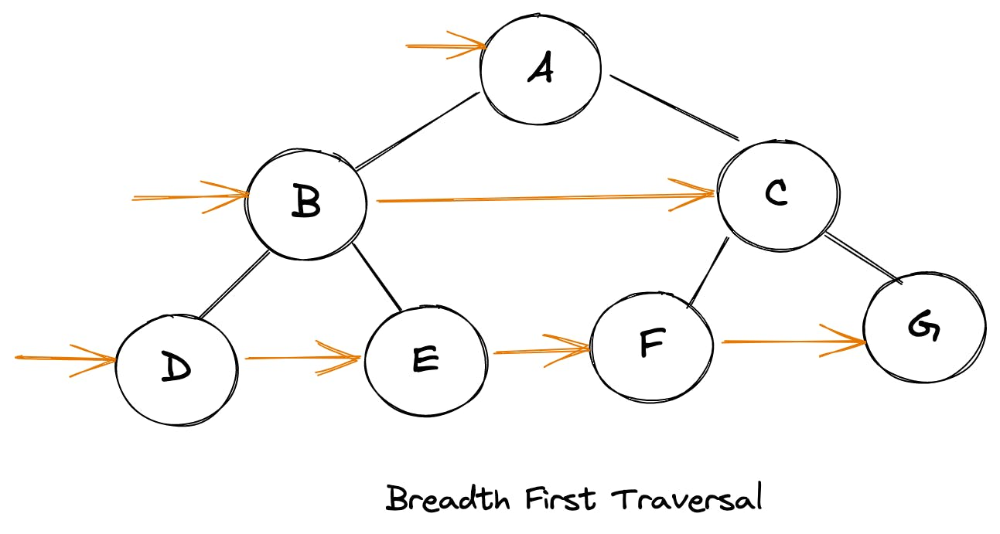
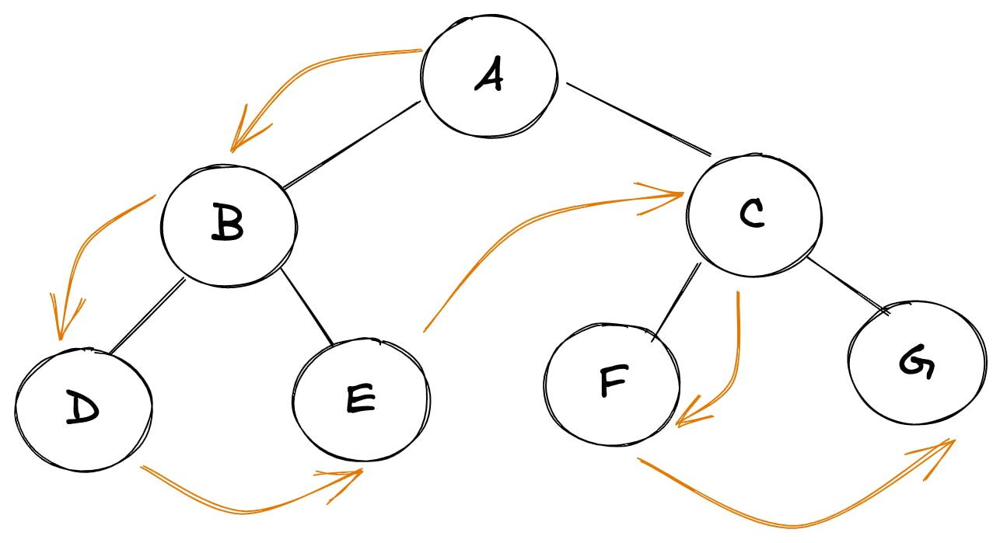
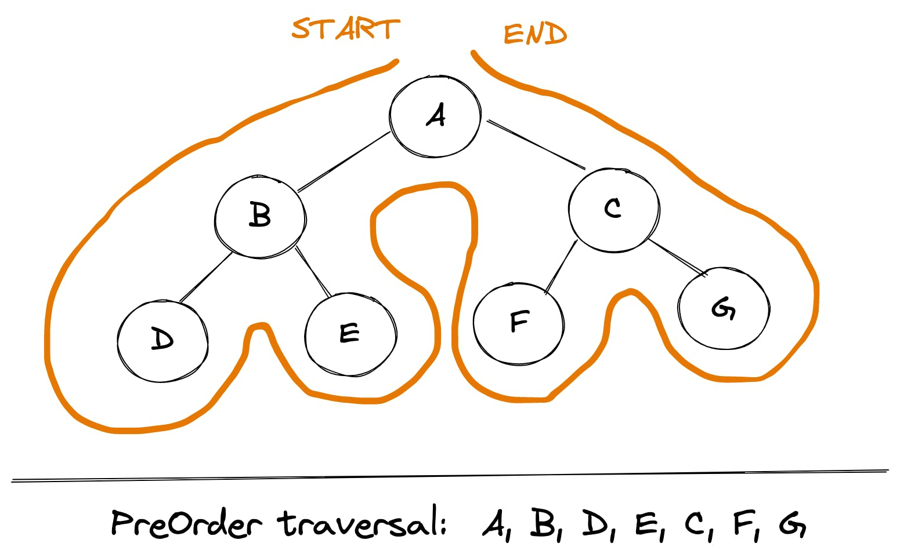
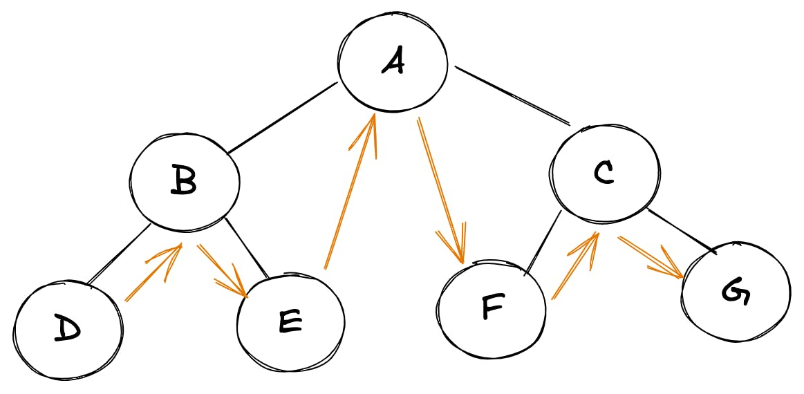
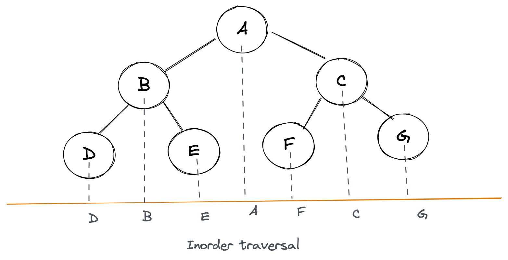
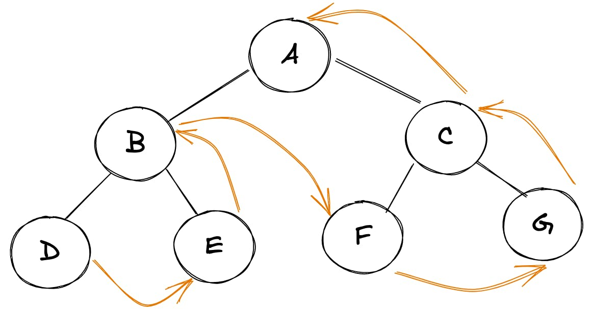
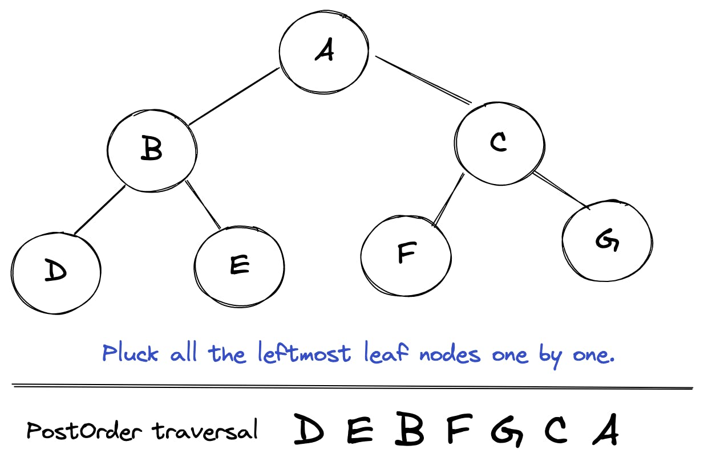

# JavaScript 中的树数据结构

树是一种有趣的数据结构。它在各个领域都有广泛的应用。

例如：

- DOM 是一种树状数据结构
- 我们操作系统中的目录和文件可以表示为树
- 家庭层次结构可以表示为一棵树。

树的许多变体（例如堆、BST 等）可用于解决与调度、图像处理、数据库等相关的问题。许多复杂的问题乍一看似乎与树无关，但可以实际上被表示为一个树。

## 二叉树

实现一个二叉树，非常简单：

```js
function Node(value){
  this.value = value
  this.left = null
  this.right = null
}
// usage
const root = new Node(2)
root.left = new Node(1)
root.right = new Node(3)
```

## 遍历

让我们从尝试遍历这些连接的树节点（或一棵树）开始。正如我们可以遍历数组一样，如果我们也可以“遍历”树节点，那将会很酷。然而，树不是像数组那样的线性数据结构，所以遍历这些的方法不止一种。我们可以将遍历方法大致分为以下几类：

- 广度优先遍历
- 深度优先遍历

### 广度优先遍历 BFS

在这种方法中，我们逐层遍历树。我们将从根开始，然后覆盖它的所有子级，然后覆盖所有 2 级子级，依此类推。例如，对于上面的树，遍历将导致如下结果：

```
2, 1, 3
```

这是一个稍微复杂的树的插图，使这更容易理解：




为了实现这种形式的遍历，我们可以使用队列（先进先出）数据结构。以下是整个算法的样子：

- 启动一个包含 root 的队列
- 从队列中删除第一项
- 将弹出项的左右孩子推入队列
- 重复步骤 2 和 3，直到队列为空

下面是这个算法在实现后的样子：

```js
function walkBFS(root){
  if (root === null) {
    return
  }

  const queue = [root]

  while (queue.length) {
      const item = queue.shift()
      // do something
      console.log(item)

      if (item.left) {
        queue.push(item.left)
      }

      if (item.right) {
        queue.push(item.right)
      }
   }
}
```

我们可以稍微修改上面的算法以返回一个数组数组，其中每个内部数组代表一个包含元素的级别：

```js
function walkBFS(root) {
  if (root === null) {
    return
  }

  const queue = [root]
  const ans = []

  while (queue.length) {
    const len = queue.length
    const level = []
    for (let i = 0; i < len; i++) {
      const item = queue.shift()
      level.push(item)
      if (item.left) {
        queue.push(item.left)
      }
      if (item.right) {
        queue.push(item.right)
      }
    }
    ans.push(level)
  }
  return ans
}
```

### 深度优先遍历 DFS

在 DFS 中，我们取一个节点并继续探索它的子节点，直到深度耗尽为止。它可以通过以下方式之一完成：

- 先序遍历：根左右
- 中序遍历：左根右
- 后序遍历：左右根

```
root node -> left node -> right node // pre-order traversal
left node -> root node -> right node // in-order traversal
left node -> right node -> root node // post-order traversal
```

所有这些遍历技术都可以递归和迭代实现。让我们进入实现细节：

#### 前序遍历

这是树的 PreOrder 遍历的样子：

```
 root node -> left node -> right node
```



我们可以使用这个简单的技巧来手动找出任何树的 PreOrder 遍历：从根节点开始遍历整棵树，保持自己在左边。



让我们深入研究这种遍历的实际实现。 递归方法相当直观。


```js
function walkPreOrder(root) {
  if (root === null) {
    return
  }

  // do something here
  console.log(root.value)

  // recurse through child nodes
  if (root.left) {
    walkPreOrder(root.left)
  }
  if (root.right) {
    walkPreOrder(root.right)
  }
}
```

PreOrder 遍历的迭代方法与 BFS 非常相似，除了我们使用 `stack` 代替 `queue` 并且我们首先将右孩子推入堆栈：

```js
function walkPreOrder(root) {
  if (root === null) {
    return
  }

  const stack = [root]
  while (stack.length) {
    const item = stack.pop()

    // do something
    console.log(item)

    // Left child is pushed after right one, since we want to print left child first hence it must be above right child in the stack
    if (item.right) {
      stack.push(item.right)
    }
    if (item.left) {
      stack.push(item.left)
    }
  }
}
```

#### 中序遍历

下面是一棵树的 InOrder 遍历的样子：

```
root node -> left node -> right node
```



我们可以使用这个简单的技巧来手动找出任何树的 InOrder 遍历：在树的底部水平放置一个平面镜，并获取所有节点的投影。



```js
function walkInOrder(root) {
  if (root === null) {
    return
  }

  if (root.left) {
    walkInOrder(root.left)
  }

  // do something here
  console.log(root)

  if (root.right) {
    walkInOrder(root.right)
  }
}
```

这个算法起初可能看起来有点神秘。但它相当直观。让我们这样看：在 InOrder 遍历中，最左边的孩子首先被打印，然后是根，然后是右孩子。所以首先想到的是想出这样的东西：

```js
let curr = root

while (curr) {
  while (curr.left) {
    curr = curr.left // get to leftmost child
  }

  console.log(curr) // print it

  curr = curr.right // now move to right child
}
```

在上述方法中，我们无法回溯，即返回导致最左侧节点的父节点。所以我们需要一个堆栈来记录这些。因此，我们修订后的方法可能如下所示：

```js
const stack = []
let curr = root

while (stack.length || curr) {
  while (curr) {
    stack.push(curr) // keep recording the trail, to backtrack
    curr = curr.left // get to leftmost child
  }
  const leftMost = stack.pop()
  console.log(leftMost) // print it

  curr = leftMost.right // now move to right child
}
```

现在我们可以使用上面的方法来制定最终的迭代算法：

```js
function walkInOrder(root) {
  if (root === null) {
    return
  }

  const stack = []
  let current = root

  while (stack.length || current) {
    while (current) {
      stack.push(current)
      current = current.left
    }
    const last = stack.pop()

    // do something
    console.log(last)

    current = last.right
  }
}
```

#### 后序遍历

以下是树的 postOrder 遍历的样子：

```
left node -> right node -> root node
```



对于任何树的快速手动 PostOrder 遍历：一个接一个地提取所有最左边的叶节点。



让我们深入研究这种遍历的实际实现。

```js
function walkPostOrder(root) {
  if (root === null) {
    return
  }

  if (root.left) {
    walkPostOrder(root.left)
  }
  if (root.right) {
    walkPostOrder(root.right)
  }

  // do something here
  console.log(root)
}
```

我们已经有了用于 preOrder 遍历的迭代算法。我们可以用那个吗？由于 PostOrder 遍历似乎只是 PreOrder 遍历的反向。让我们来看看：

```
// PreOrder:
root -> left -> right

// Reverse of PreOrder:
right -> left -> root

// But PostOrder is:
left -> right -> root
```

啊! 所以有一点点区别。但是我们可以通过稍微修改我们的 PreOrder 算法然后反转它应该给出 PostOrder 结果来适应这一点。总体算法将是：

```
// record result using
root -> right -> left

// reverse result
left -> right -> root
```

- 使用与上述迭代 preOrder 算法类似的方法，使用临时stack.
    - 唯一的例外是我们去 root -> right -> left 而不是 root -> left -> right
- 继续记录数组中的遍历序列 result
- 反转result给出 postOrder 遍历


```js
function walkPostOrder(root) {
  if (root === null) {
    return []
  }

  const tempStack = [root]
  const result = []

  while (tempStack.length) {
    const last = tempStack.pop()

    result.push(last)

    if (last.left) {
      tempStack.push(last.left)
    }
    if (last.right) {
      tempStack.push(last.right)
    }

    console.log("last", last);
  }

  return result.reverse()
}
```

## JavaScript 实用例子

如果我们可以通过以下方式遍历树该多好：

```js
for (let node of walkPreOrder(tree)) {
  console.log(node)
}
```

看起来真的很好而且很容易阅读，不是吗？我们所要做的就是使用一个walk函数，它会返回一个迭代器。

以下是我们如何修改 walkPreOrder 上面的函数以按照上面共享的示例运行：


```js
function* walkPreOrder(root) {
  if (root === null) {
    return
  }

  const stack = [root]

  while (stack.length) {
    const item = stack.pop()
    yield item
    if (item.right) {
      stack.push(item.right)
    }
    if (item.left) {
      stack.push(item.left)
    }
  }
}


for (let node of walkPreOrder(root)) {
  console.log(node)
}
```

原文链接：[Tree data structure in JavaScript](https://stackfull.dev/tree-data-structure-in-javascript)

## Keywords

`数据结构` `二叉树` `遍历`

<!-- author alvin -->
<!-- email alvinhtml@gmail.com -->
<!-- createAt 2021-10-24 20:00:00 -->
<!-- updateAt 2021-10-24 20:00:00 -->
