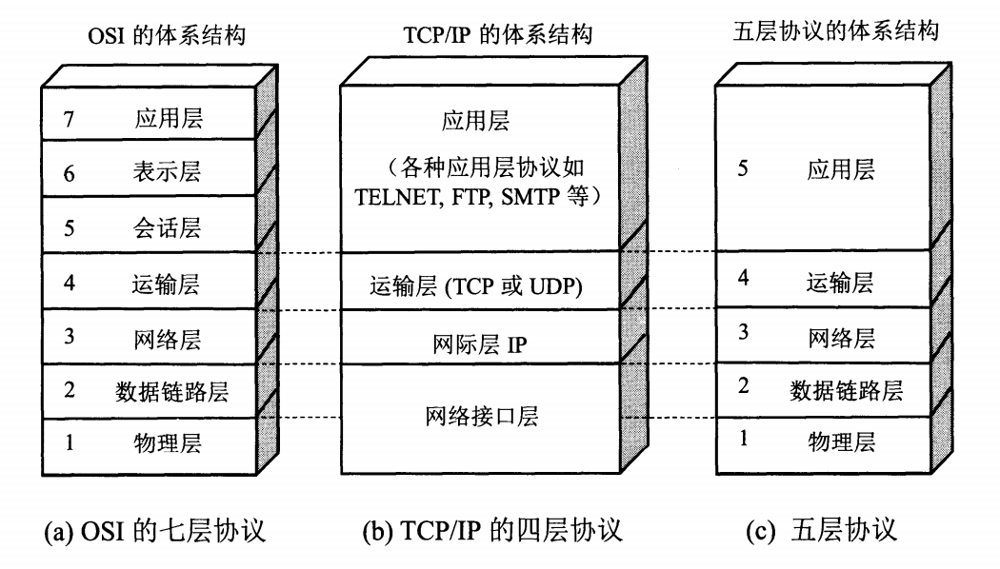

# 计算机网络

## 计算机网络体系结构

### OSI 体系结构（七层协议）




分层|作用|协议
--|--|--|
应用层|允许访问OSI环境的手段（应用协议数据单元 APDU）|FTP、DNS、Telnet、SMTP、HTTP、WWW、NFS
表示层|对数据进行翻译、加密和压缩（表示协议数据单元 PPDU）|JPEG、MPEG、ASII
会话层|建立、管理和终止会话（会话协议数据单元 SPDU）|NFS、SQL、NETBIOS、RPC
传输层|提供端到端的可靠报文传递和错误恢复（ 段Segment）|TCP、UDP、SPX
网络层|负责数据包从源到宿的传递和网际互连（包 Packet）|IP、ICMP、ARP、RARP、OSPF、IPX、RIP、IGRP（路由器）
数据链路层|将比特组装成帧和点到点的传递（帧 Frame）|PPP、FR、HDLC、VLAN、MAC（网桥，交换机）
物理层|通过媒介传输比特，确定机械及电气规范（比特 Bit）|RJ45、CLOCK、IEEE802.3（中继器，集线器）

### 数据进入协议栈时的封装过程


### 以太网数据分用过程


## 应用层

### DNS

DNS（Domain Name System，域名系统）是互联网的一项服务。它作为将域名和 IP 地址相互映射的一个分布式数据库，能够使人更方便地访问互联网。DNS 使用 TCP 和 UDP 端口 53。当前，对于每一级域名长度的限制是 63 个字符，域名总长度则不能超过 253 个字符。
域名
域名 ::= {<三级域名>.<二级域名>.<顶级域名>}，如：blog.huihut.com

### FTP

FTP（File Transfer Protocol，文件传输协议）是用于在网络上进行文件传输的一套标准协议，使用客户/服务器模式，使用 TCP 数据报，提供交互式访问，双向传输。
TFTP（Trivial File Transfer Protocol，简单文件传输协议）一个小且易实现的文件传输协议，也使用客户-服务器方式，使用UDP数据报，只支持文件传输而不支持交互，没有列目录，不能对用户进行身份鉴定。

### TELNET

TELNET 协议是 TCP/IP 协议族中的一员，是 Internet 远程登陆服务的标准协议和主要方式。它为用户提供了在本地计算机上完成远程主机工作的能力。

HTTP（HyperText Transfer Protocol，超文本传输协议）是用于从 WWW（World Wide Web，万维网）服务器传输超文本到本地浏览器的传送协议。

SMTP（Simple Mail Transfer Protocol，简单邮件传输协议）是一组用于由源地址到目的地址传送邮件的规则，由它来控制信件的中转方式。SMTP 协议属于 TCP/IP 协议簇，它帮助每台

计算机在发送或中转信件时找到下一个目的地。
Socket 建立网络通信连接至少要一对端口号（Socket）。Socket 本质是编程接口（API），对 TCP/IP 的封装，TCP/IP 也要提供可供程序员做网络开发所用的接口，这就是 Socket 编程接口。

### WWW

WWW（World Wide Web，环球信息网，万维网）是一个由许多互相链接的超文本组成的系统，通过互联网访问

### URL

URL（Uniform Resource Locator，统一资源定位符）是因特网上标准的资源的地址（Address）

标准格式

```
协议类型:[//服务器地址[:端口号]][/资源层级UNIX文件路径]文件名[?查询][#片段ID]
```
完整格式

```
协议类型:[//[访问资源需要的凭证信息@]服务器地址[:端口号]][/资源层级UNIX文件路径]文件名[?查询][#片段ID]
```

### HTTP

HTTP（HyperText Transfer Protocol，超文本传输协议）是一种用于分布式、协作式和超媒体信息系统的应用层协议。HTTP 是万维网的数据通信的基础。


### 其他协议


#### SMTP

SMTP（Simple Main Transfer Protocol，简单邮件传输协议）是在 Internet 传输 Email 的标准，是一个相对简单的基于文本的协议。在其之上指定了一条消息的一个或多个接收者（在大多数情况下被确认是存在的），然后消息文本会被传输。可以很简单地通过 Telnet 程序来测试一个 SMTP 服务器。SMTP 使用 TCP 端口 25。

#### DHCP

DHCP（Dynamic Host Configuration Protocol，动态主机设置协议）是一个局域网的网络协议，使用 UDP 协议工作，主要有两个用途： 1、用于内部网络或网络服务供应商自动分配 IP 地址给用户；2、用于内部网络管理员作为对所有电脑作中央管理的手段

#### SNMP

SNMP（Simple Network Management Protocol，简单网络管理协议）构成了互联网工程工作小组（IETF，Internet Engineering Task Force）定义的 Internet 协议族的一部分。该协议能够支持网络管理系统，用以监测连接到网络上的设备是否有任何引起管理上关注的情况。

## 表示层

表示层没什么可说的，就是对数据进行翻译、加密和压缩，用JPEG、MPEG、ASII等。

## 会话层

会话层也没什么可说的，进行建立、管理和终止会话。

## 传输层

协议：TCP（Transmission Control Protocol，传输控制协议） UDP（User Datagram Protocol，用户数据报协议）


### 端口

应用程序|FTP|TELNET|SMTP|DNS|TFTP|HTTP|HTTPS|SNMP
-|-|-|-|-|-|-|-|-
端口号|21|23|25|53|69|80|443|161


