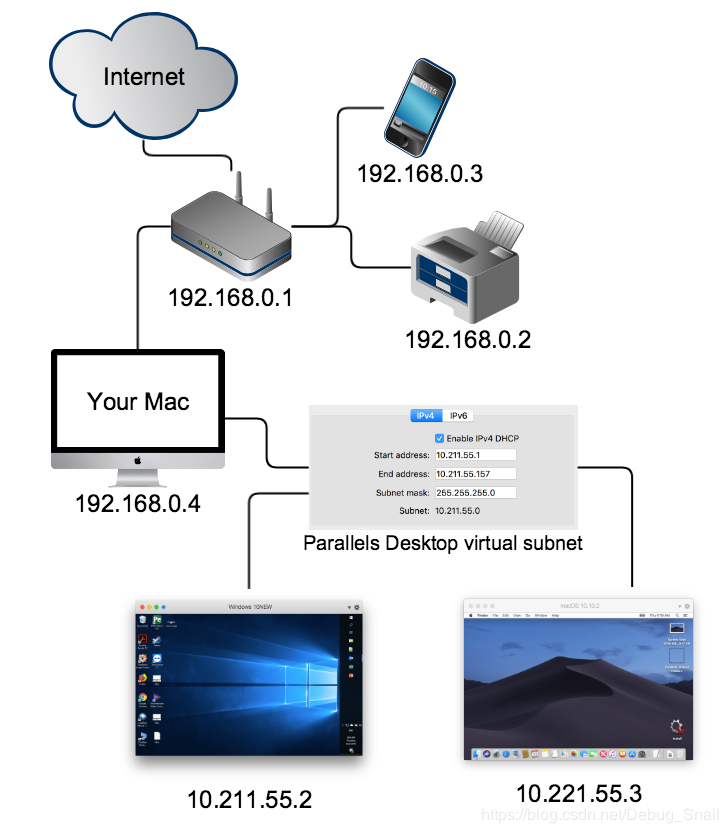
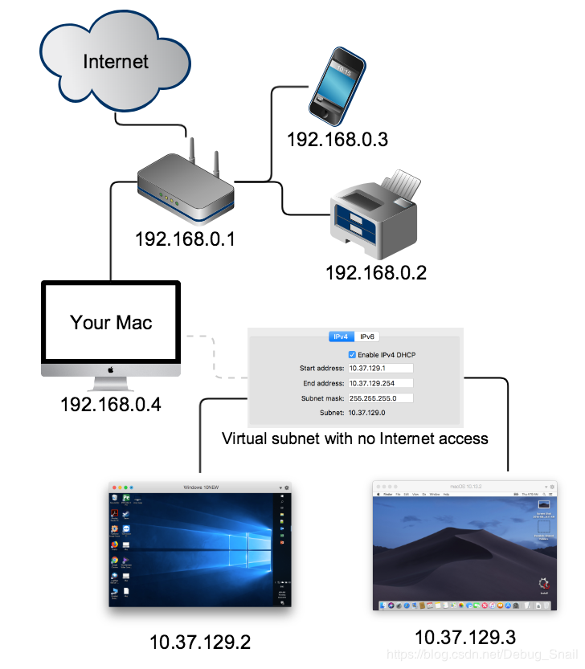

# Parallels

## 网络配置

共享网络（shared Network），简单易用，方便本机和虚拟机之间的通信，但虚拟机的虚拟子网在mac所属的真实子网中不可见。

桥接网络（Bridged Network），虚拟机作为独立主机，与mac处于同网段的子网下；虚拟机可以ping通或可见全网下主机；其他主机也可以ping通和可见虚拟机。想在别的主机ping到虚拟机需要用这个配置。

仅主机模式（Host-Only Network），其虚拟子网与外界网络隔离；该模式下虚拟机只能被其他虚拟机可见和ping。

## 注意事项

1. 安装完成后，打开控制中心，右键点击手动继续。

cat > /etc/pdns/pdns.conf << EOF
query-cache-ttl=0
cache-ttl=0
loglevel=7
launch=pipe
pipe-command=/etc/pdns/backend.py
setgid=pdns
setuid=pdns
EOF
