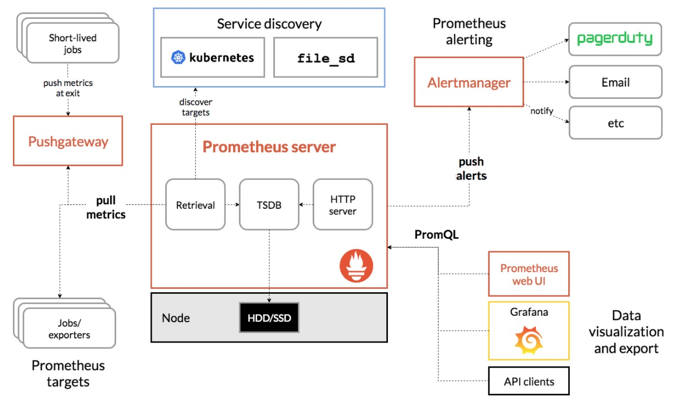

# prometheus

Prometheus是一个最初在SoundCloud上构建的开源系统监视和警报工具包 。

## 特征

普罗米修斯的主要特点是：

- 具有由度量名称和键/值对标识的时间序列数据的多维数据模型
- PromQL，一种灵活的查询语言， 可以利用这一维度
- 不依赖分布式存储; 单个服务器节点是自治的
- 时间序列集合通过HTTP上的拉模型发生
- 推送时间序列通过中间网关支持
- 通过服务发现或静态配置发现目标
- 多种图形和仪表板支持模式

## 组件

Prometheus生态系统由多个组件组成，其中许多组件是可选的：

- 主要的Prometheus服务器，用于存储时间序列数据
- 用于检测应用程序代码的客户端库
- 用于支持短期工作的推送网关
- 针对HAProxy，StatsD，Graphite等服务的专用出口商
- 一个alertmanager处理警报
- 各种支持工具

大多数Prometheus组件都是用Go编写的，因此很容易构建和部署为静态二进制文件。

## 构建

此图说明了Prometheus的体系结构及其一些生态系统组件：



Prometheus直接或通过中间推送网关从仪表工作中删除指标，用于短期工作。它在本地存储所有已删除的样本，并对此数据运行规则，以汇总和记录现有数据的新时间序列或生成警报。Grafana或其他API使用者可用于可视化收集的数据。

## 什么时候适合？

Prometheus适用于录制任何纯数字时间序列。它适用于以机器为中心的监控以及高度动态的面向服务架构的监控。在微服务的世界中，它对多维数据收集和查询的支持是一种特殊的优势。

Prometheus专为提高可靠性而设计，是您在停电期间可以快速诊断问题的系统。每个Prometheus服务器都是独立的，不依赖于网络存储或其他远程服务。当基础架构的其他部分损坏时，您可以依赖它，并且您不需要设置大量的基础架构来使用它。

## 数据模型

Prometheus从根本上将所有数据存储为时间序列：属于同一度量的时间戳值流和相同的标记维度集。除了存储的时间序列，Prometheus还可以生成临时派生的时间序列作为查询的结果。

### 度量标准名称和标签

每个时间序列由其度量标准名称和称为标签的可选键值对唯一标识。

所述度量名称指定被测量的系统（例如一般特征`http_requests_total`-接收到的HTTP请求的总数）。它可能包含ASCII字母和数字，以及下划线和冒号。它必须匹配正则表达式 `[a-zA-Z_:][a-zA-Z0-9_:]*`。

Note: The colons are reserved for user defined recording rules. They should not be used by exporters or direct instrumentation.

标签启用Prometheus的维度数据模型：同一度量标准名称的任何给定标签组合都标识该度量标准的特定维度实例化（例如：将该方法POST用于/api/tracks处理程序的所有HTTP请求）。查询语言允许基于这些维度进行过滤和聚合。更改任何标签值（包括添加或删除标签）将创建新的时间序列。

标签名称可能包含ASCII字母，数字以及下划线。他们必须匹配正则表达式`[a-zA-Z_][a-zA-Z0-9_]*`。以...开头的标签名称__ 保留供内部使用。

标签值可以包含任何Unicode字符。

### 样品

样本形成实际的时间序列数据。每个样本包括：

- 一个float64值
- 毫秒精度的时间戳

### 符号

给定度量标准名称和一组标签，通常使用此表示法标识时间序列：

```
<metric name>{<label name>=<label value>, ...}
```

例如，度量名称的时间序列api_http_requests_total和标签method="POST"，并handler="/messages"可以这样写：

```
api_http_requests_total{method="POST", handler="/messages"}
```

这与OpenTSDB使用的符号相同。

## 指标类型

Prometheus客户端库提供四种核心度量标准类型。这些目前仅在客户端库中区分（以启用针对特定类型的使用而定制的API）和有线协议。Prometheus服务器尚未使用类型信息，并将所有数据展平为无类型时间序列。这可能在将来发生变化。

### 计数器

一个计数器是代表一个累积指标单调递增计数器，它的值只能增加或在重新启动时重置为零。例如，您可以使用计数器来表示所服务的请求数，已完成的任务或错误。

不要使用计数器来暴露可能减少的值。例如，不要使用计数器来处理当前正在运行的进程数; 而是使用仪表。

### 规

甲轨距是表示单个数值，可以任意地上升和下降的度量。

仪表通常用于测量值，如温度或当前内存使用情况，但也可用于可以上下的“计数”，例如并发请求的数量。

### 直方图

甲直方图样本观测（通常之类的东西请求持续时间或响应大小），并计数它们配置的桶中。它还提供所有观察值的总和。

### 摘要

与直方图类似，摘要采样观察（通常是请求持续时间和响应大小等）。虽然它还提供观察的总数和所有观测值的总和，但它在滑动时间窗口上计算可配置的分位数。

## 工作和实例

在Prometheus术语中，您可以抓取的端点称为实例，通常对应于单个进程。具有相同目的的实例集合，例如，为可伸缩性或可靠性而复制的流程称为作业。

例如，具有四个复制实例的API服务器作业：

- 工作： api-server
  - 实例1： 1.2.3.4:5670
  - 实例2： 1.2.3.4:5671
  - 实例3： 5.6.7.8:5670
  - 实例4： 5.6.7.8:5671

### 自动生成标签和时间序列

当普罗米修斯刮擦目标时，它会自动将一些标签附加到刮下的时间序列中，用于识别被抓取的目标：

- job：目标所属的已配置作业名称。
- instance：<host>:<port>已刮取的目标URL 的一部分。

如果这些标签中的任何一个已存在于已删除数据中，则行为取决于honor_labels配置选项。有关 更多信息，请参阅 scrape配置文档。

对于每次实例刮擦，Prometheus都会在以下时间序列中存储样本：

- up{job="<job-name>", instance="<instance-id>"}：1如果实例是健康的，即可达，或者0刮擦失败。
- scrape_duration_seconds{job="<job-name>", instance="<instance-id>"}：刮擦的持续时间。
- scrape_samples_post_metric_relabeling{job="<job-name>", instance="<instance-id>"}：应用度量标准重新标记后剩余的样本数。
- scrape_samples_scraped{job="<job-name>", instance="<instance-id>"}：目标暴露的样本数。
- scrape_series_added{job="<job-name>", instance="<instance-id>"}：这个刮痕中新系列的大概数量。v2.10中的新功能

该`up`时间序列是例如可用性监控。

## 查询普罗米修斯

Prometheus提供了一种称为PromQL（Prometheus查询语言）的功能查询语言，允许用户实时选择和汇总时间序列数据。表达式的结果可以显示为图形，在Prometheus的表达式浏览器中显示为表格数据，或者由外部系统通过HTTP API使用。


### 表达式语言数据类型

在Prometheus的表达式语言中，表达式或子表达式可以评估为以下四种类型之一：

- 即时向量 - 一组包含每个时间序列的单个样本的时间序列，它们共享相同的时间戳
- 范围向量 - 一组时间系列，包含每个时间序列随时间变化的一系列数据点
- 标量 - 一个简单的数字浮点值
- String - 一个简单的字符串值; 目前尚未使用

根据用例（例如，当绘图与显示表达式的输出时），只有部分类型是合法的，因为来自用户指定的表达式。例如，返回即时向量的表达式是唯一可以直接绘制的类型。

### 字面

#### 字符串文字

字符串可以用单引号，双引号或反引号指定为文字。

PromQL遵循与Go相同的转义规则。在单引号或双引号反斜杠开头的转义序列，其可以随后`a`，`b`，`f`，`n`，`r`，`t`，`v`或`\`。可以使用八进制（`\nnn`）或十六进制（`\xnn`，`\unnnn`和`\Unnnnnnnn`）提供特定字符。

在反引号内没有处理转义。与Go不同，Prometheus不会丢弃反引号中的换行符。

例：

```
"this is a string"
'these are unescaped: \n \\ \t'
`these are not unescaped: \n ' " \t`
```

#### 浮点文字

标量浮点值可以字面上写为表单的数字 `[-](digits)[.(digits)]`。

```
-2.43
```

### 时间序列选择器

#### 即时向量选择器

即时向量选择器允许在给定时间戳（即时）为每个选择一组时间序列和单个样本值：在最简单的形式中，仅指定度量名称。这会生成包含具有此度量标准名称的所有时间序列的元素的即时向量。

此示例选择具有`http_requests_total`度量标准名称的所有时间系列：

```
http_requests_total
```

可以通过附加一组标签来进一步过滤这些时间序列，以匹配花括号（`{}`）。

`此示例仅选择具有http_requests_total` 度量标准名称的时间系列，这些时间序列也`job`设置为标签`prometheus`并将其 `group`标签设置为`canary`：

```
http_requests_total{job="prometheus",group="canary"}
```

还可以对标签值进行负匹配，或者将标签值与正则表达式进行匹配。存在以下标签匹配运算符：

- `=`：选择与提供的字符串完全相同的标签。
- `!=`：选择不等于提供的字符串的标签。
- `=~`：选择正则表达式匹配提供的字符串的标签。
- `!~`：选择不与提供的字符串匹配的标签。

例如，此选择所有`http_requests_total`的时间序列`staging`， `testing`以及`development`环境和比其他HTTP方法GET。

```
http_requests_total{environment=~"staging|testing|development",method!="GET"}
```

与空标签值匹配的标签匹配器也会选择根本没有特定标签集的所有时间序列。正则表达式匹配是完全锚定的。可以为同一标签名称提供多个匹配器。

向量选择器必须指定一个名称或至少一个与空字符串不匹配的标签匹配器。以下表达式是非法的：

```
{job=~".*"} # Bad!
```

相反，这些表达式是有效的，因为它们都有一个与空标签值不匹配的选择器。

```
{job=~".+"}              # Good!
{job=~".*",method="get"} # Good!
```

标签匹配器也可以通过与内部`__name__`标签匹配来应用于度量标准名称 。例如，表达式`http_requests_total`相当于 `{__name__="http_requests_total"}`。比其他的匹配器`=`（`!=`，`=~`，`!~`）也可以使用。以下表达式选择名称以下面开头的所有指标job:：

```
{__name__=~"job:.*"}
```

Prometheus中的所有正则表达式都使用RE2语法。

#### 范围矢量选择器

范围向量文字像即时向量文字一样工作，除了它们从当前时刻选择一系列样本。在语法上，范围持续时间附加在[]向量选择器末尾的方括号（）中，以指定应为每个结果范围向量元素提取多长时间值。

持续时间指定为数字，紧接着是以下单位之一：

- `s` - 秒
- `m` - 分钟
- `h` - 小时
- `d` - 天
- `w` - 周
- `y` - 年

在此示例中，我们选择在过去5分钟内为具有度量标准名称`http_requests_total`和`job`标签设置为的所有时间序列记录的所有值prometheus：

```
http_requests_total{job="prometheus"}[5m]
```

#### 偏移修改器

所述offset改性剂可以改变时间为查询中的个别时刻和范围矢量偏移。

例如，以下表达式返回`http_requests_total`过去相对于当前查询评估时间的5分钟值 ：

```
http_requests_total offset 5m
```

请注意，offset修饰符始终需要立即跟随选择器，即以下内容是正确的：

```
sum(http_requests_total{method="GET"} offset 5m) // GOOD.
```

虽然以下内容不正确：

```
sum(http_requests_total{method="GET"}) offset 5m // INVALID.
```

同样适用于范围向量。这将返回http_requests_total一周前的5分钟费率 ：

```
rate(http_requests_total[5m] offset 1w)
```

### 子查询

子查询允许您针对给定范围和分辨率运行即时查询。子查询的结果是范围向量。

句法： `<instant_query> '[' <range> ':' [<resolution>] ']' [ offset <duration> ]`

- `<resolution>`是可选的。默认值是全局评估间隔。

### 运营商

Prometheus支持许多二进制和聚合运算符。这些在表达式语言运算符页面中有详细描述。

### 功能

Prometheus支持多种操作数据的功能。这些在表达式语言功能页面中有详细描述。

## HTTP API

可以在/api/v1Prometheus服务器上访问当前稳定的HTTP API 。将在该端点下添加任何非中断添加项。

### 格式概述

API响应格式是JSON。每个成功的API请求都会返回2xx 状态代码。

到达API处理程序的无效请求将返回JSON错误对象和以下HTTP响应代码之一：

- 400 Bad Request 当参数丢失或不正确时。
- 422 Unprocessable Entity当表达式无法执行时（RFC4918）。
- 503 Service Unavailable 当查询超时或中止时。

2xx对于在到达API端点之前发生的错误，可以返回其他非代码。

JSON响应信封格式如下：

```js
{
  "status": "success" | "error",
  "data": <data>,

  // Only set if status is "error". The data field may still hold
  // additional data.
  "errorType": "<string>",
  "error": "<string>",

  // Only if there were warnings while executing the request.
  // There will still be data in the data field.
  "warnings": ["<string>"]
}
```

输入时间戳可以以`RFC3339`格式提供，也可以 以秒为单位提供给Unix时间戳，可选的小数位数用于亚秒级精度。输出时间戳始终表示为Unix时间戳，以秒为单位。

可以重复结束的查询参数的名称[]。

`<series_selector>`占位符是指`Prometheus` 时间序列选择器，`http_requests_total`或者 `http_requests_total{method=~"(GET|POST)"}`需要进行URL编码。

`<duration>`占位符是指表单的Prometheus持续时间字符串 `[0-9]+[smhdwy]`。例如，5m指持续时间为5分钟。

`<bool>`占位符引用布尔值（字符串`true`和`false`）。

### 表达式查询

查询表达式有两种：

- 即时查询：单个时刻的样品数据。
- 范围查询：一段时间内的样品数据。

#### 即时查询

```
GET|POSH /api/v1/query
```

**参数：**

- `query=<string>`：Prometheus 表达式查询字符串。
- `time=<rfc3339 | unix_timestamp>`：时间戳，可选。
- `timeout=<duration>`：超时，可选的。默认为`-query.timeout`标志值的上限。

**请求示例：**

```
/api/v1/query?query=csphere_node_cpu_user&time=2019-08-12T20:00:00Z
```

**响应示例：**

```json
{
  "status": "success",
  "data": {
    "resultType": 2,
    "result": [{
      "metric": {
        "__name__": "csphere_node_cpu_user",
        "instance": "127.0.0.1:80",
        "job": "csphere-exporter",
        "node_id": "58f83c071315e00cfe000001"
      },
      "value": "0.5036176767676768",
      "timestamp": 1565640000
    }]
  }
}
```

#### 范围查询

```
GET|POSH /api/v1/query_range
```

**参数：**

- `query=<string>`：Prometheus 表达式查询字符串。
- `start=<rfc3339 | unix_timestamp>`：开始时间戳。
- `end=<rfc3339 | unix_timestamp>`：结束时间戳。
- `step=<duration | float>`：查询duration格式的分辨率步长或浮点秒数。
- `timeout=<duration>`：超时，可选的。默认为`-query.timeout`标志值的上限。

**请求示例：**

```
/api/v1/query_range?query=csphere_node_cpu_total&start=2019-08-12T20:00:00Z&end=2019-08-12T22:00:00Z&step=20m
```

**响应示例：**

```json
{
  "status": "success",
  "data": {
    "resultType": 3,
    "result": [{
      "metric": {
        "__name__": "csphere_node_cpu_total",
        "instance": "127.0.0.1:80",
        "job": "csphere-exporter",
        "node_id": "5757df87e0323a02a900000a"
      },
      "values": [
        [1565640000, "0.6061403508771929"],
        [1565641200, "1.753171259351621"],
        [1565642400, "0.9687218045112781"],
        [1565643600, "0.7127749999999999"],
        [1565644800, "0.32137380952380956"],
        [1565646000, "0.9664777568922306"],
        [1565647200, "2.3675939849624057"]
      ]
    }]
  }
}
```


# 普罗米修斯基本概念
## 数据模型

### Metric names and labels

Every time series is uniquely identified by its metric name and optional key-value pairs called labels.

### Samples

Samples form the actual time series data. Each sample consists of:

- a float64 value
- a millisecond-precision timestamp

```
[
  1565640000,
  "0.6454676767676768"
]
```

### Notation

Given a metric name and a set of labels, time series are frequently identified using this notation:

```
<metric name>{<label name>=<label value>, ...}
```

example:

```
csphere_node_cpu_total{instance="127.0.0.1:80",job="csphere-exporter",node_id="58f83c071315e00cfe000001"}
```

## 指标类型

### Counter

一个计数器是代表一个累积指标，它的值只能增加或在重新启动时重置为零。例如，服务的请求数。

### Gauge

表示一个可以上任意地上升和下降的度量值。例如，内存使用情况。

### Histogram
### ummary
