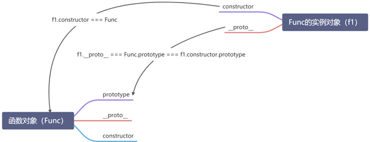

# JavaScript 继承的实现

在所有面向对象的编程语言中，继承都是一个非常重要的特性，继承有很多优点，比如实现逻辑复用，减少重复代码，节省内存空间，利于整体维护等。在 JS 中，也可以实现继承，对于有基于类的语言开发经验的人来说，JS 的继承可能会让人有点困惑，因为 JS 本身不提供类继承的实现，虽然在 ES6 中引入了 class 关键字，但只是语法糖，JavaScript 继承实际上仍然是基于原型的，那么原型是什么，继承又是如何实现的，今天我们来详细探讨下。

## JavaScript 原型和原型链

在理解原型之前，我们先看一下为什么需要原型，假设我们有一个 Person 函数：

```js
function Person(name) {
  this.name = name;
  this.sayName = function () {
    console.log(this.name);
  };
}

const P1 = new Person("John");
const P2 = new Person("Amy");
```

这在段代码中，我们每 new 一个实例，`sayName()` 方法都会在内存中被拷贝一份，这就会造成内存的浪费，我们实际上希望所有实例都共用同一个 `sayName()` 方法，JavaScript 中的原型就是用来帮我们实现共享属性或方法的。

将以上代码替换成原型的写法：

```js
function Person(name) {
  this.name = name;
}

Person.prototype.sayName = function () {
  console.log(this.name);
};
```

这样，无论我们 new 多少次，`sayName()` 在内存中始终只存在一份。

我们知道，在 JavaScript 中只有一种结构，即对象，每个实例对象（object）都有一个私有属性（`__proto__`）指向它的构造函数的原型对象（`prototype`），该原型对象也有一个自己的原型对象（`__proto__`），这种一层一层往上的链接关系被称作原型链，原型链的最后一个对象是 `null`，根据定义 `null` 没有原型。

对于 `prototype` 和 `__proto__` 我们需要搞懂的是：

- `prototype` 是构造函数才有的属性，prototype 所指向的对象，就是我们常说的原型对象；
- `__proto__` 是实例对象才有的属性，它相当于提供了一个可以让我们通过实例访问原型的方式；
- JavaScript 中函数也是对象，所以函数不但拥有 `prototype`，还有 `__proto__` 属性。

它们之间的关系，可以参考下图：



实例对象除了 `prototype` 还有一个属性是 `constructor`，它指向实例对象的构造函数，一定要区分清楚构造函数和实例对象的区别。

知道了原型和原型链，我们来看下如何利用原型实现继承。

## 继承

在 JavaScript 中，继承是基于原型实现的，当试图访问一个对象的属性时，它不仅仅在该对象上搜寻，还会搜寻该对象的原型，以及该对象的原型的原型，依次层层向上搜索，直到找到一个名字匹配的属性或到达原型链的末尾，所以我们只需要将一个对象的原型指向另一个实例对象，就能实现继承。

接下来我们试着用 ES5 语法实现继承的几种不同写法，并探讨它们的优缺点。

### 一、原型链继承

我们先看最简单的继承方式，原型链继承，其方式是将子类构造函数的 prototype 指向父类对象的实例。

如下代码实现了一个简单的原型链继承：

```js
function Person(name) {
  this.name = name;
}

Person.prototype.sayName = function () {
  console.log(this.name);
};

function Employee(title) {
  this.title = title;
}

// 将子类 Employee 的 prototype 指向父类 Person 的实例
Employee.prototype = new Person("John");

const employee = new Employee("Manager");

employee.sayName();
```

Person 类的原型上有一个 sayName() 方法，我们希望 Employee 也能继承这个方法，所以我们将 Employee 的 prototype 指向 Person 类的一个实例。

这种方式的优点是简单，但缺点也很明显，就在继承的同时，不能传递参数 name。

### 二、构造函数继承

如何将参数传递给父类，你可能会想到 call、apply，构造函数继承即是利 call、apply 调用父类的构造函数。

```js
function Person(name) {
  this.name = name;
}

Person.prototype.sayName = function () {
  console.log(this.name);
};

function Employee(name, title) {
  // 利用 call 调用父类构造函数
  Person.call(this, name);
  this.title = title;
}

const employee = new Employee("John", "Manager");

console.log(employee.name);
console.log(employee.sayName); // undefined
```

与原型继承相比，虽然实现了参数传递，但不能继承父类原型上的方法。你可能会想到，能不能将两种方式结合起来呢？这就是第三种继承方式：**组合继承**。

### 三、组合继承

组合继承的思想是使用 call 调用父类构建函数的同时，将 prototype 指向父类对象的实例，具体代码如下：

```js
function Person(name) {
  this.name = name;
}

Person.prototype.sayName = function () {
  console.log(this.name);
};

function Employee(name, title) {
  Person.call(this, name);
  this.title = title;
}

Employee.prototype = new Person();

const employee = new Employee("John", "Manager");
employee.sayName();
console.log(employee.constructor); // Person
```

将前面两种方式结合后，不仅可以传递参数，还能继承原型链中的方法。

当我们打印 `employee.constructor` 的时候，发现指向的却是父类构造函数，所以我们需要手动修复下。

```js
Employee.prototype.constructor = Employee;
```

但是上面这种继承方式还是有些小问题，细心的你可能已经发现，构造函数 Person 被调用了两次。

### 四、寄生继承

寄生继承的思想是创建一个空对象，将父类对象上的属性和方法浅拷贝到这个空对象上，然后将子类的 prototype 指向这个新创建的对象。

```js
// 这里省略了其它代码

function objectCreate(obj) {
  function F() {}
  F.prototype = obj;
  return new F();
}

Employee.prototype = objectCreate(Person.prototype);
```

通过一个中间对象避免了构造函数两次调用的问题，在 JavaScript 中，Object 有个 `create()` 方法可以基于现有对象创建一个新对象，我们可以使用它来代替 `objectCreate()`。

寄生继承的完整代码如下：

```js
function Person(name) {
  this.name = name;
}

Person.prototype.sayName = function () {
  console.log(this.name);
};

function Employee(name, title) {
  Person.call(this, name);
  this.title = title;
}

Employee.prototype = Object.create(Person.prototype);
Employee.prototype.constructor = Employee;

const employee = new Employee("John", "Manager");

employee.sayName();
```

## 结束语

寄生继承是一种较为完善的继承方式，解决了其它继承方式不足的地方，虽然在日常开发中，我们主要是使用 ES6 的 class、extends 关键字来实现继承，但了解其背后的原理能够避免出现很多不必要的 bug。

## 参考

- [JavaScript inheritance and the prototype chain](https://developer.mozilla.org/en-US/docs/Web/JavaScript/Inheritance_and_the_prototype_chain)
- [JavaScript Object create()](https://developer.mozilla.org/zh-CN/docs/Web/JavaScript/Reference/Global_Objects/Object/create)
