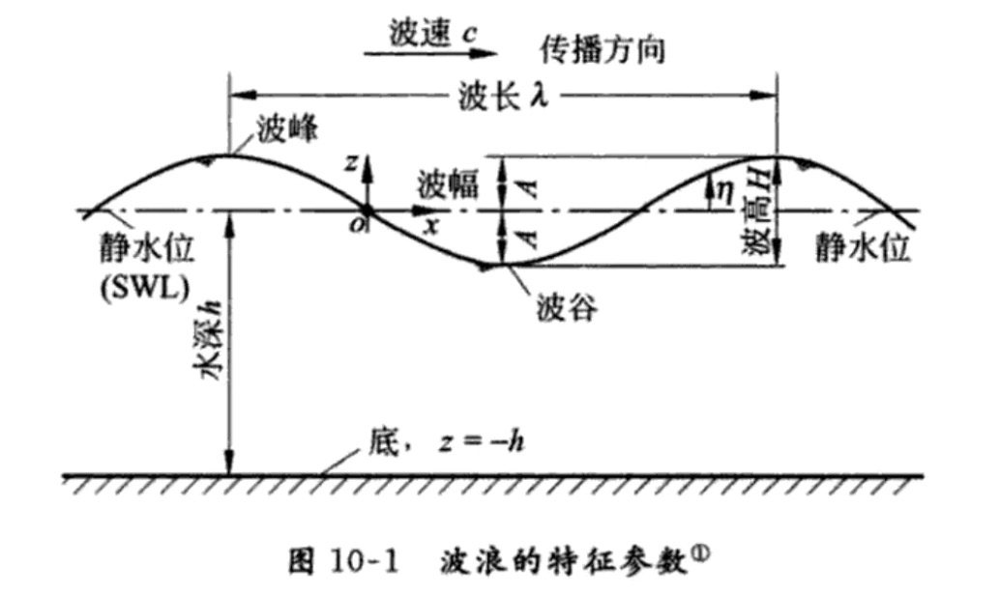
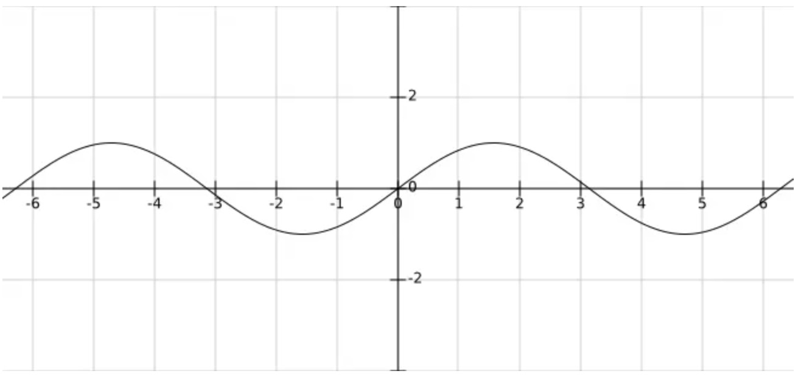
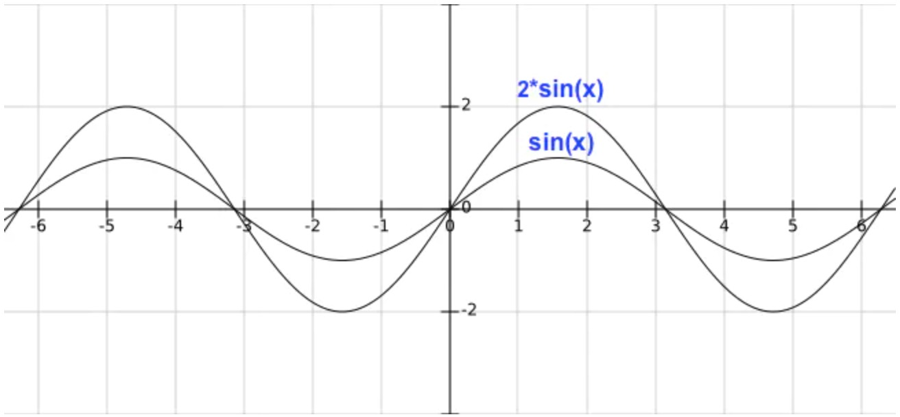
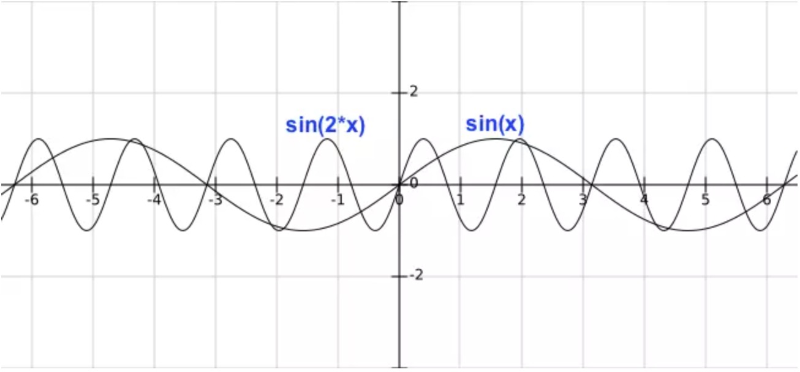
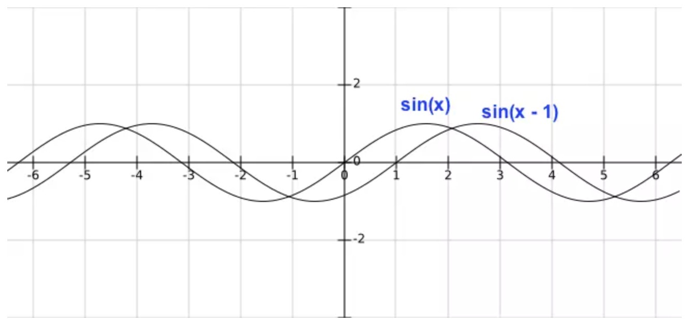
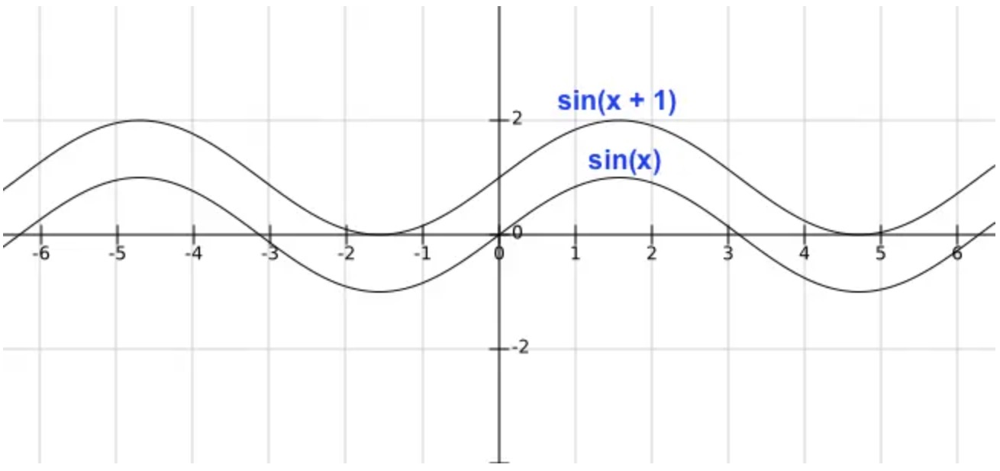

# Canvas 绘制水波浪

## 波浪的特征



由波浪的特征可以看出，正余弦曲线是最简单而又最接近实际波形的表述。

## 正弦曲线



正弦曲线公式：**y = A sin(2π/B − C/B) + D**

- 振幅(A)：控制波浪的高度
- 周期(B)：控制波浪的宽度
- 相移(C)：控制波浪的水平移动
- 垂直位移(D)：控制水位的高度

振幅是 A，A 值越大，曲线更陡峭:



周期是 2π/B，B 值大于 1 时，B 值越大，周期越短，B 值小于 1 大于 0 时，周期变长:



相移是 −C/B，在 B 不变的情况，C 为正值时，曲线向左移动，C 为负值时，曲线向右移动：



垂直位移是 D，控制曲线上下移动：



```js
const mycanvas = document.getElementById('mycanvas');
const context = mycanvas.getContext('2d');
const canvasWidth = mycanvas.width;
const canvasHeight = mycanvas.height;

function drawWave(context) {
  const waveWidth = 100; // A 波浪宽度
  const waveHeight = 5; // B 波浪高度
  const xOffset = 0; // C 水平位动
  const yOffset = 0; // D 垂直位移

  context.beginPath();

  for (let x = 0; x < canvasWidth; x += 0.5) {
    const y = waveHeight * Math.sin(x * (2 * Math.PI) / waveWidth - (xOffset / waveWidth)) + yOffset;
    context.lineTo(x, canvasHeight / 2 + y);
  }

  context.lineTo(canvasWidth, canvasHeight);
  context.lineTo(0, canvasHeight);
  context.stroke();
  context.fill();
}

drawWave(context);
```

# 心形函数

心形函数公式

```
0 < t < 2π
x = 16(sin(t))³
y = 13cos(t) - 5cos(2t) - 2cos(3t) - cos(4t)
```

```js
function drawHeart(context) {
  let step = 100;
  let a = 10; // 控制心形大小

  context.beginPath();
  // context.moveTo(0, 5);

  for (let i = 0; i < step; i++) {
    const t = (i / step) * (2 * Math.PI);
    const x = a * -1 * (16 * Math.pow(Math.sin(t), 3));
    const y = a * -1 * (13 * Math.cos(t) - 5 * Math.cos(2 * t) - 2 * Math.cos(3 * t) - Math.cos(4 * t));
    console.log("x, y", x, y);
    context.lineTo(x, y);
  }

  context.stroke();
  context.fill();
}
```
