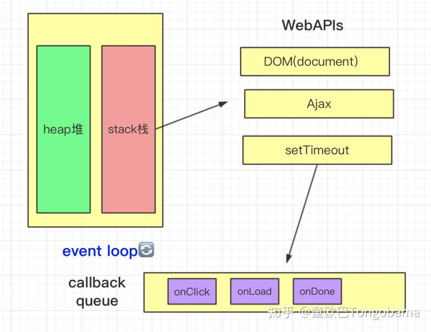

# Javascript Event Loop

想要了解JavaScript引擎，首先我们从它的运行机制Event Loop来说起。

## 进程和线程

### 进程

进程指在系统中正在运行的一个应用程序；程序一旦运行就是进程；或者更专业化来说：进程是指程序执行时的一个实例，即它是程序已经执行到课中程度的数据结构的汇集。从内核的观点看，进程的目的就是担当分配系统资源（CPU时间、内存等）的基本单位。


### 线程

系统分配处理器时间资源的基本单元，或者说进程之内独立执行的一个单元执行流。

线程是进程内的一个独立执行单元，在不同的线程之间是可以共享进程资源的。

进程拥有独立的堆栈空间和数据段，每当启动一个新的进程必须分配给它独立的地址空间，建立众多的数据表来维护它的代码段、堆栈段和数据段。

线程拥有独立的堆栈空间，但是共享数据段，它们彼此之间使用相同的地址空间，共享大部分数据，比进程更节俭，开销比较小，切换速度也比进程快，效率高。

一句话解释进程和线程:

- **进程：** 资源分配的最小单位
- **线程：** 程序执行的最小单位


## JavaScript 为什么是单线程执行？

在多线程操作下可以实现应用的并行处理，从而以更高的 CPU 利用率提高整个应用程序的性能和吞吐量。特别是现在很多语言都支持多核并行处理技术，然而 JavaScript 却以单线程执行，为什么呢？

JavaScript作为脚本语言，最初被设计用于浏览器。为了避免 **复杂的同步问题** ，如果JavaScript同时有两个线程，一个线程中执行在某个DOM节点上添加内容，另一个线程执行删除这个节点，这时浏览器会一脸懵逼。

所以JavaScript的单线程是这门语言的核心，未来也不会改变。

有人说，那HTML5的新特性Web Worker，可以创建多线程呀～

是的，为了解决不可避免的耗时操作(多重循环、复杂的运算)，HTML5提出了Web Worker，它会在当前的js执行主线程中开辟出一个额外的线程来运行js文件，这个新的线程和js主线程之间不会互相影响，同时提供了数据交换的接口：postMessage和onMessage。

但是因为它创建的子线程完全受控于主线程，且位于外部文件中，无法访问DOM。所以它并没有改变js单线程的本质。

单线程就意味着，所有的任务都需要排队。

就像还不能自助点餐的时候你去肯德基需要排队，有的人没想好点什么或者点的东西很多，耗时就会长，那么后面的人也只好排队等待。有了自助点餐服务后，一切问题迎刃而解。


语言的设计和生活中的现实情况很像，IO设备(输入输出)很慢(比如Ajax)，那么语言的设计者意识到这一点，就在主线程中挂起处于等待中的任务，先运行后面的任务，等IO设备有了结果，再把挂起的任务执行下去。

```
JavaScript的主要用途是与用户互动，以及操作DOM。这决定了它只能是单线程，否则会带来很复杂的同步问题
Web Worker标准，允许JavaScript脚本创建多个线程，但是子线程完全受主线程控制，且不得操作DOM。所以，这个新标准并没有改变JavaScript单线程的本质
```

## Event Loop



从上图中我们可以看到，在主线程运行时，会产生堆(heap)和栈(stack)。

堆中存的是我们声明的object类型的数据，栈中存的是基本数据类型以及函数执行时的运行空间。

栈中的代码会调用各种外部API，它们在任务队列中加入各种事件(onClick,onLoad,onDone)，只要栈中的代码执行完毕(js引擎存在monitoring process进程，会持续不断的检查主线程执行栈是否为空)，主线程就回去读取任务队列，在按顺序执行这些事件对应的回调函数。

也就是说主线程从任务队列中读取事件，这个过程是循环不断的，所以这种运行机制又成为Event Loop(事件循环)。


## 同步任务和异步任务

我们可以将任务分为同步任务和异步任务。

同步任务就是在主线程上排队执行的任务，只能执行完一个再执行下一个。

异步任务则不进入主线程，而是先在 event table 中注册函数，当满足触发条件后，才可以进入任务队列来执行。只有任务队列通知主线程说，我这边异步任务可以执行了，这个时候此任务才会进入主线程执行。

举个🌰

```js
console.log(a);

setTimeout(
  function () {
      console.log(b);
  },1000)

console.log(c)  

// a
// c
// b
```

- 1. console.log(a)是同步任务，进入主线程执行，打印a。
- 2. setTimeout是异步任务，先被放入event table中注册，1000ms之后进入任务队列。
- 3. console.log(c)是同步任务，进入主线程执行，打印c。

当a，c被打印后，主线程去事件队列中找到setTimeout里的函数，并执行，打印b。


## 宏任务和微任务

本文的 Macrotask 在 WHATWG 中叫 task。Macrotask为了便于理解，并没有实际的出处。

同步任务和异步任务的划分其实并不准确，准确的分类方式是宏任务(Macrotask)和微任务(Microtask)。

宏任务包括：script(整体代码)，I/O， setTimeout，setInterval，requestAnimationFrame，setImmediate。

其中setImmediate只存在于Node中，requestAnimationFrame只存在于浏览器中。

微任务包括： Promise，Object.observe(已废弃)，MutationObserver(html5新特性)，process.nextTick。

其中process.nextTick只存在于Node中，MutationObserver只存在于浏览器中。

> UI Rendering不属于宏任务，也不属于微任务，它是一个与微任务平行的一个操作步骤。


这种分类的执行方式就是，执行一个宏任务，过程中遇到微任务时，将其放到微任务的事件队列里，当前宏任务执行完成后，会查看微任务的事件队列，依次执行里面的微任务。如果还有宏任务的话，再重新开启宏任务……

再举个🌰

```js
setTimeout(function() {
	console.log('a')
});

new Promise(function(resolve) {
	console.log('b');

	for(var i =0; i <100000; i++) {
		i ==99999 && resolve();
	}
}).then(function() {
	console.log('c')
});

console.log('d');

// b
// d
// c
// a
```

1. 首先执行script下的宏任务，遇到setTimeout，将其放入宏任务的队列里。
2. 遇到Promise，new Promise直接执行，打印b。
3. 遇到then方法，是微任务，将其放到微任务的队列里。
4. 遇到console.log('d')，直接打印。
5. 本轮宏任务执行完毕，查看微任务，发现then方法里的函数，打印c。
6. 本轮event loop全部完成。
7. 下一轮循环，先执行宏任务，发现宏任务队列中有一个setTimeout，打印a。


```js
console.log('a');

setTimeout(function() {
    console.log('b');
    process.nextTick(function() {
        console.log('c');
    })
    new Promise(function(resolve) {
        console.log('d');
        resolve();
    }).then(function() {
        console.log('e')
    })
})
process.nextTick(function() {
    console.log('f');
})
new Promise(function(resolve) {
    console.log('g');
    resolve();
}).then(function() {
    console.log('h')
})

setTimeout(function() {
    console.log('i');
    process.nextTick(function() {
        console.log('j');
    })
    new Promise(function(resolve) {
        console.log('k');
        resolve();
    }).then(function() {
        console.log('l')
    })
})
```

## 总结

- JavaScript 单线程执行是为了避免复杂的同步问题
- Event Loop
  - JS 是单线程，单线程就意味着，所有的任务都需要排队执行，这种队列就是JS “任务队列”。
  - Event Loop 就是 JS 处理 “任务队列” 的一种执行机制。
  - 为什么叫 Event Loop ？ 主线程从 "任务队列" 中读取事件，这个过程不断循环，所以叫 Event Loop。
  - JS 的任务分为宏任务和微任务。
    - 宏任务：script(整体代码)，I/O， setTimeout，requestAnimationFrame
    - 微任务包括： Promise，MutationObserver(html5新特性)，process.nextTick
    - 一次 Event Loop 的边程
      1. 首先执行第一个宏任务，script(整体代码)。
      2. 遇到新的宏任务，放到宏任务队列，遇到新的微任务，放到微任务队列。
      3. 直到本轮宏任务执行完毕，查看微任务，执行微任务。
      4. 本轮 event loop 全部完成。
      5. 下一轮循环，先执行宏任务。
