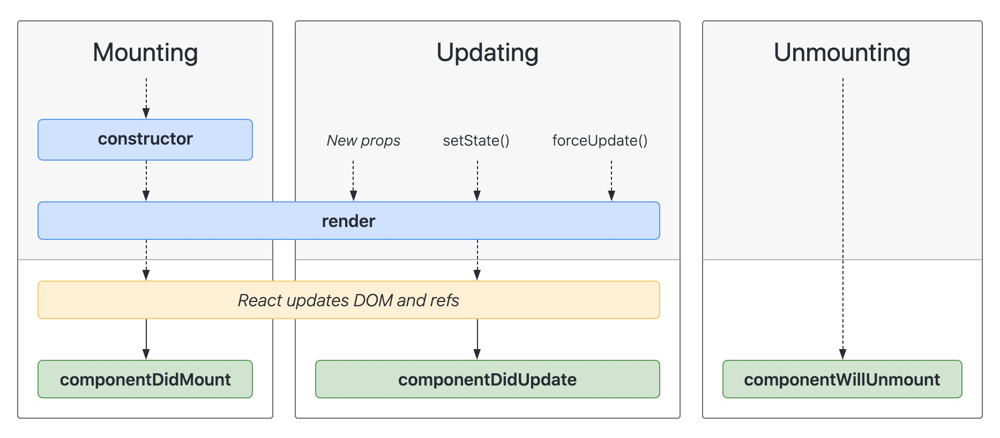

# React

## React 和 Vue 对比

单从文档方面的对比来说Vue需要记住各种指令，还有属性细节，免不了经常查文档。React 相对简单，记住：“函数入口是 props，出口是 html”就行了。框架功能上，暂时没有发现 Vue 做的来 React 做不来的事情，反过来也一样，两个框架都能满足功能需求。 工程实践上，由于耦合性、代码组织灵活性、平滑升级、测试、重构让我们最终放弃了 Vue。在 Vue 中你操作的是定义好的对象，React 中你操作的是一个函数。所谓前端开发，本质就是在编写下面几个函数。

```
S = async(A1)
S = sync(A2)
UI = f(S)
```

显然，React 对此的抽象更为彻底。

## React 组件生命周期

组件的生命周期可分成三个状态：

- Mounting：已插入真实 DOM
- Updating：正在被重新渲染
- Unmounting：已移出真实 DOM



### 挂载

当组件实例被创建并插入 DOM 中时，其生命周期调用顺序如下：

- constructor()
- static getDerivedStateFromProps()
- render()
- componentDidMount()

### 更新

当组件的 props 或 state 发生变化时会触发更新。组件更新的生命周期调用顺序如下：

- static getDerivedStateFromProps()
- shouldComponentUpdate()
- render()
- getSnapshotBeforeUpdate()
- componentDidUpdate()

### 卸载

当组件从 DOM 中移除时会调用如下方法：

- componentWillUnmount()

### 错误处理
当渲染过程，生命周期，或子组件的构造函数中抛出错误时，会调用如下方法：

- static getDerivedStateFromError()
- componentDidCatch()


### 过时的生命周期

部分[过时的生命周期函数](https://zh-hans.reactjs.org/blog/2018/03/27/update-on-async-rendering.html)将在 `17.0` 版本删除，具体函数如下：

```
componentWillMount
componentWillReceiveProps
componentWillUpdate
```

### 新的生命周期函数

#### getDerivedStateFromProps

新的静态 getDerivedStateFromProps 生命周期方法在组件实例化之后以及重新渲染之前调用。它可以返回一个对象来更新 state，或者返回 null 来表示新的 props 不需要任何 state 的更新。

最常见的误解就是 getDerivedStateFromProps 和 componentWillReceiveProps 只会在 props “改变” 时才会调用。实际上只要父级重新渲染时，这两个生命周期函数就会重新调用，不管 props 有没有“变化”。

```
class EmailInput extends Component {
  state = {
    email: this.props.defaultEmail,
    prevPropsUserID: this.props.userID
  };

  static getDerivedStateFromProps(props, state) {
    // 只要当前 user 变化，
    // 重置所有跟 user 相关的状态。
    // 这个例子中，只有 email 和 user 相关。
    if (props.userID !== state.prevPropsUserID) {
      return {
        prevPropsUserID: props.userID,
        email: props.defaultEmail
      };
    }
    return null;
  }

  // ...
}
```

#### getSnapshotBeforeUpdate

新的 getSnapshotBeforeUpdate 生命周期方法在更新之前（如：更新 DOM 之前）被调用。此生命周期的返回值将作为第三个参数传递给 componentDidUpdate。（通常不需要，但在重新渲染过程中手动保留滚动位置等情况下非常有用。）


## React.Component

React.Component 提供了一些额外的 API：

- setState()
- forceUpdate()

class 属性

- defaultProps
- displayName

实例属性

- props
- state

## React Fiber

### 同步更新过程的局限

当React决定要加载或者更新组件树时，会做很多事，比如调用各个组件的生命周期函数，计算和比对Virtual DOM，最后更新DOM树，这整个过程是同步进行的，也就是说只要一个加载或者更新过程开始，那React就一鼓作气运行到底，中途绝不停歇，在这个过程中，浏览器那个唯一的主线程都在专心运行更新操作，无暇去做任何其他的事情，导致界面卡顿等限象。

### React Fiber的方式

React Fiber 把一个耗时长的任务分成很多小片，每一个小片的运行时间很短，虽然总时间依然很长，但是在每个小片执行完之后，都给其他任务一个执行的机会，这样唯一的线程就不会被独占，其他任务依然有运行的机会。

React Fiber 一个更新过程被分为两个阶段(Phase)：第一个阶段 Reconciliation Phase和第二阶段 Commit Phase。

在以前的React中，每个生命周期函数在一个加载或者更新过程中绝对只会被调用一次；在React Fiber中，不再是这样了，第一阶段中的生命周期函数在一次加载和更新过程中可能会被多次调用！


## 异步方案选型 redux-saga 和 redux-thunk

redux 中的 action 仅支持原始对象（plain object），处理有副作用的action，需要使用中间件。中间件可以在发出 action，到 reducer 函数接受 action 之间，执行具有副作用的操作。

### redux-thunk

thunk是redux作者给出的中间件，实现极为简单，10多行代码, 做的事情也很简单，判别 action 的类型，如果 action 是函数，就调用这个函数。

thunk 使得 redux 可以接受函数作为 action，缺点是 action 可谓是多种多样，不利于维护。

### redux-saga

redux-saga 的优缺点

优点：

1. 集中处理了所有的异步操作，异步接口部分一目了然
1. action 是普通对象，这跟 redux 同步的 action 一模一样
1. 通过 Effect，方便异步接口的测试
1. 通过 worker 和 watcher 可以实现非阻塞异步调用，并且同时可以实现非阻塞调用下的事件监听
1. 异步操作的流程是可以控制的，可以随时取消相应的异步操作。

缺点：

1. 太复杂，学习成本较高


##
国内前端大环境认为前端开发是工程问题，而非工艺问题（工程问题追求流程可控，工艺问题追求细节可控）。

从ES3/CSS2时代过来的人，技术成长是一个迭代的过程，所有技术应当是层次分明的。

作为从ES3/CSS2时代过来的人，我的web前端技术栈是这样的：DOM/BOM/CSS/Typescript/单向数据流/双向绑定/虚拟元素/CSS in JS/事件驱动/异步编程 / React Fiber...

分析一下上面这些东西层级关系（浏览器前端应用简称应用）：

DOM/BOM/CSS 是浏览器提供的应用运行时环境。
Typescript是语言工具，相对于原生JS的优势这里不扩展讲。
虚拟元素 是应用视图元素管理策略。
CSS in JS 是应用样式管理策略。
单向数据流 / 双向绑定 是应用状态更新策略。
事件驱动 / 异步编程 / React Fiber  是应用持续事务管理策略。

特点很明显，只有底层工具与开发策略相关的东西，底层工具与策略的相结合才能写出一个完整的前端应用。而事实上，Angular/Vue/React等框架只把这些东西中的一部分以API的形式提供给开发者, 损失的灵活性不容小觑。
