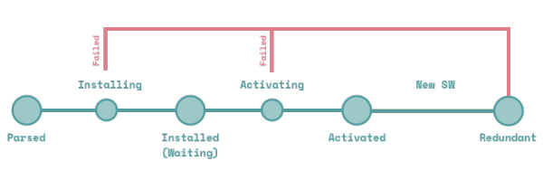

# Service Worker

随着前端快速发展，应用的性能已经变得至关重要，如何降低一个页面的网络请求成本从而缩短页面加载资源的时间并降低用户可感知的延时是非常重要的一部分。对于提升应用的加载速度常用的手段有Http Cache、异步加载、304缓存、文件压缩、CDN、CSS Sprite、开启GZIP等等。这些手段无非是在做一件事情，就是让资源更快速的下载到浏览器端。但是除了这些方法，其实还有更加强大的Service Worker线程。

## Service Worker与PWA的现状

说起service worker就不得不提起PWA了，service worker做为PWA的核心技术之一，多年来一直被Google大力推广，这里简单介绍一下。

通俗来说，PWA就是渐进式web应用(Progressive Web App)。早在16年初，Google便提出PWA，希望提供更强大的web体验，引导开发者回归开放互联网。它弥补了web对比Native App急缺的几个能力，比如离线使用、后台加载、添加到主屏和消息推送等，同时它还具备了小程序标榜的“无需安装、用完即走”的特性。

虽然PWA技术已经被W3C列为标准，但是其落地情况一直以来是很让人失望的，始终受到苹果的阻碍，最重要的原因在于PWA绕过Apple Store审核，直接推给用户。如果普及，这将威胁到苹果的平台权威，也就意味着苹果与开发者的三七分成生意将会落空。

所以一直以来safrai不支持mainfest以及service worker这两项关键技术，即使在18年开始支持了，但是对PWA的支持力度也远远低于安卓，具体体现在service worker缓存无法永久保存，以及service worker的API支持不够完善，一个最明显的不同在于安卓版本的PWA会保留你的登录状态，并且会系统级推送消息。而在苹果上，这两点都做不到。也就是说，iPhone上的微博PWA，每次打开都要重新登录，而且不会收到任何推送信息。

另外由于某些不可描述的原因，在国内无法使用Service Worker的推送功能，虽然国内已经有两家公司做了service worker的浏览器推送，但是成熟度还有待调研。

由于目前各版本手机浏览器对service worker的支持度都不太相同，同一个接口也存在差异化还有待统一，之于我们来说，也只能用Service Worker做一做PC浏览器的缓存了。

## Service Worker 的由来

Service Worker（以下简称sw）是基于WEB Worker而来的。

众所周知，javaScript 是单线程的，随着web业务的复杂化，开发者逐渐在js中做了许多耗费资源的运算过程，这使得单线程的弊端更加凹显。web worker正是基于此被创造出来，它是脱离在主线程之外的，我们可以将复杂耗费时间的事情交给web worker来做。但是web worker作为一个独立的线程，他的功能应当不仅于此。sw便是在web worker的基础上增加了离线缓存的能力。当然在 Service Worker 之前也有在 HTML5 上做离线缓存的 API 叫 AppCache, 但是 AppCache 存在很多缺点。

sw是由事件驱动的,具有生命周期，可以拦截处理页面的所有网络请求(fetch)，可以访问cache和indexDB，支持推送，并且可以让开发者自己控制管理缓存的内容以及版本，为离线弱网环境下的 web 的运行提供了可能，让 web 在体验上更加贴近 native。换句话说他可以把你应用里的所有静态动态资源根据不同策略缓存起来，在你下次打开时不再需要去服务器请求，这样一来就减少了网络耗时，使得web应用可以秒开，并且在离线环境下也变得可用。做到这一切你只需要增加一个sw文件，不会对原有的代码产生任何侵入，是不是很perfect？

## Service Worker基本特征

无法操作DOM

只能使用HTTPS以及localhost

可以拦截全站请求从而控制你的应用

与主线程独立不会被阻塞（不要再应用加载时注册sw）

完全异步，无法使用XHR和localStorage

一旦被 install，就永远存在，除非被 uninstall或者dev模式手动删除

独立上下文

响应推送

后台同步

。。。

service worker是事件驱动的worker，生命周期与页面无关。 关联页面未关闭时，它也可以退出，没有关联页面时，它也可以启动。

Dedicated Worker以及Shared Worker与Service Worker三者非常重要的区别在于不同的生命周期。对于Service Worker来说文档无关的生命周期，是它能提供可靠Web服务的一个重要基础。



register 这个是由 client 端发起，注册一个 serviceWorker，这需要一个专门处理sw逻辑的文件

Parsed 注册完成，解析成功，尚未安装

installing 注册中，此时 sw 中会触发 install 事件， 需知 sw 中都是事件触发的方式进行的逻辑调用，如果事件里有 event.waitUntil() 则会等待传入的 Promise 完成才会成功

installed(waiting) 注册完成，但是页面被旧的 Service Worker 脚本控制, 所以当前的脚本尚未激活处于等待中，可以通过 self.skipWaiting() 跳过等待。

activating 安装后要等待激活，也就是 activated 事件，只要 register 成功后就会触发 install ，但不会立即触发 activated，如果事件里有 event.waitUntil() 则会等待这个 Promise 完成才会成功，这时可以调用 Clients.claim() 接管所有页面。

activated 在 activated 之后就可以开始对 client 的请求进行拦截处理，sw 发起请求用的是 fetch api，XHR无法使用

fetch 激活以后开始对网页中发起的请求进行拦截处理

terminate 这一步是浏览器自身的判断处理，当 sw 长时间不用之后，处于闲置状态，浏览器会把该 sw 暂停，直到再次使用

update 浏览器会自动检测 sw 文件的更新，当有更新时会下载并 install，但页面中还是老的 sw 在控制，只有当用户新开窗口后新的 sw 才能激活控制页面

redundant 安装失败, 或者激活失败, 或者被新的 Service Worker 替代掉

Service Worker 脚本最常用的功能是截获请求和缓存资源文件, 这些行为可以绑定在下面这些事件上:

install 事件中, 抓取资源进行缓存

activate 事件中, 遍历缓存, 清除过期的资源

fetch 事件中, 拦截请求, 查询缓存或者网络, 返回请求的资源


## Service Worker实践

我们先从sw的注册开始，官方给的demo里的注册是这样的：

```js
if ('serviceWorker' in navigator) {
  navigator.serviceWorker.register('service-worker.js');
}
```

但是这样做会有一些问题，页面在首次打开的时候就进行缓存sw的资源，因为sw内预缓存资源是需要下载的，sw线程一旦在首次打开时下载资源，将会占用主线程的带宽，以及加剧对cpu和内存的使用，而且Service worker 启动之前，它必须先向浏览器 UI 线程申请分派一个线程，再回到 IO 线程继续执行 service worker 线程的启动流程，并且在随后多次在ui线程和io线程之间切换，所以在启动过程中会存在一定的性能开销，在手机端尤其严重。

况且首次打开各种资源都非常宝贵，完全没有必要争第一次打开页面就要缓存资源。正确的做法是，页面加载完以后sw的事。

正确的姿势：

```js
if ('serviceWorker' in navigator) {
  window.addEventListener('load', function() {
    navigator.serviceWorker.register('/sw.js');
  });
}
```

但是仅仅是这样就够了吗？只有注册，那么发生问题的时候怎么注销sw呢？注销以后缓存如何处理？这些是要提前考虑好的

另外使用 sw 进行注册时，还有一个很重要的特性，即，sw的作用域不同，监听的 fetch 请求也是不一样的。假设你的sw文件放在根目录下位于/sw/sw.js路径的话，那么你的sw就只能监听/sw/*下面的请求，如果想要监听所有请求有两个办法，一个是将sw.js放在根目录下，或者是在注册是时候设置scope。

一个考虑了出错降级的简易注册demo:

```js
  window.addEventListener('load', function() {
    const sw = window.navigator.serviceWorker
    const killSW = window.killSW || false
    if (!sw) {
        return
    }
    if (!!killSW) {
        sw.getRegistration('/serviceWorker').then(registration => {
            // 手动注销
            registration.unregister();
            // 清除缓存
            window.caches && caches.keys && caches.keys().then(function(keys) {
                keys.forEach(function(key) {
                caches.delete(key);
                });
            });
        })
    } else {
        // 表示该 sw 监听的是根域名下的请求
        sw.register('/serviceWorker.js',{scope: '/'}).then(registration => {
            // 注册成功后会进入回调
            console.log('Registered events at scope: ', registration.scope);
        }).catch(err => {
            console.error(err)
        })
    }
  });
```

下面部分是sw.js文件中要做的事情，在上面注册的步骤成功以后我们首先要在sw.js文件中监听注册成功以后抛出的install事件。

```js
self.addEventListener('install', function(e) {
  // ...
})
```

通常来说，当我们监听到这个事件的时候要做的事情就是缓存所有静态文件

```js
self.addEventListener('install', function(event) {
  event.waitUntil(
    caches.open('cache-v1').then(function(cache) {
      return cache.addAll([
        '/',
        "index.html",
        "main.css",
      ]);
    })
  );
})
```

这里首先执行了一个event.waitUntil函数，该函数是service worker标准提供的函数，接收一个promise参数，并且监听函数内所有的promise,只要有一个promise的结果是reject，那么这次安装就会失败。比如说cache.addAll 时，有一个资源下载不回来，即视为整个安装失败，那么后面的操作都不会执行，只能等待sw下一次重新注册。另外waitUntil还有一个重要的特性，那就是延长事件生命周期的时间，由于浏览器会随时睡眠 sw，所以为了防止执行中断就需要使用 event.waitUntil 进行捕获，当所有加载都成功时，那么 sw 就可以下一步。

另外这里的缓存文件的列表通常来说我们应当使用webpack的插件或者其他工具在构建的时候自动生成。缓存的版本号也应当独立出来修改，这里我们将每一次的构建视作一个新的版本。

安装成功后就会等待进入activate阶段，这里要注意的是，并不是install一旦成功就会立即抛出activate事件，如果当前页面已经存在service worker进程，那么就需要等待页面下一次被打开时新的sw才会被激活，或者使用 `self.skipWaiting()` 跳过等待。

```js
const cacheStorageKey = 'testCache1';
self.addEventListener('activate', event => {
  event.waitUntil(
    caches.keys().then(cacheNames => {
      return cacheNames.filter(cacheName => cacheStorageKey !== cacheName);
    }).then(cachesToDelete => {
      return Promise.all(cachesToDelete.map(cacheToDelete => {
        return caches.delete(cacheToDelete);
      }));
    }).then(() => {
      // 立即接管所有页面
      self.clients.claim()
    })
  );
});
```

在activate中通常我们要检查并删除旧缓存，如果事件里有 `event.waitUntil()` 则会等待这个 Promise 完成才会成功。这时可以调用 Clients.claim() 接管所有页面，注意这会导致新版的sw接管旧版本页面。

当激活完毕后就可以在fetch事件中对站点作用范围下的所有请求进行拦截处理了，你可以在这个阶段灵活的使用indexDB以及caches等api制定你的缓存规则。

```js
// 发起请求时去根据uri去匹配缓存，无法命中缓存则发起请求，并且缓存请求
self.addEventListener('fetch', function(event) {
  event.respondWith(
    caches.match(event.request).then(function(resp) {
      return resp || fetch(event.request).then(function(response) {
        return caches.open('v1').then(function(cache) {
          cache.put(event.request, response.clone());
          return response;
        }); 
      });
    })
  );
});
```

event.respondWith： 接收的是一个 promise 参数，把其结果返回到受控制的 client 中，内容可以是任何自定义的响应生成代码。

另外这里有一些问题：

默认发起的fetch好像不会携带cookie，需要设置 `{ credential: 'include' }`

对于跨域的资源，需要设置 `{ mode: 'cors' }` ，否则 response 中拿不到对应的数据

对于缓存请求时，Request & Response 中的 body 只能被读取一次，因为请求和响应流只能被读取一次，其中包含 bodyUsed 属性，当使用过后，这个属性值就会变为 true， 不能再次读取，解决方法是，把 Request & Response clone 下来： `request.clone() || response.clone()`

当然这只是一个demo，实际情况是不可能像这样缓存所有请求的。如果你使用工具来实现sw的话，比如sw-toolbox，通常有如下几种缓存策略：

networkFirst：首先尝试通过网络来处理请求，如果成功就将响应存储在缓存中，否则返回缓存中的资源来回应请求。它适用于以下类型的API请求，即你总是希望返回的数据是最新的，但是如果无法获取最新数据，则返回一个可用的旧数据。

cacheFirst：如果缓存中存在与网络请求相匹配的资源，则返回相应资源，否则尝试从网络获取资源。 同时，如果网络请求成功则更新缓存。此选项适用于那些不常发生变化的资源，或者有其它更新机制的资源。

fastest：从缓存和网络并行请求资源，并以首先返回的数据作为响应，通常这意味着缓存版本则优先响应。一方面，这个策略总会产生网络请求，即使资源已经被缓存了。另一方面，当网络请求完成时，现有缓存将被更新，从而使得下次读取的缓存将是最新的。

cacheOnly：从缓存中解析请求，如果没有对应缓存则请求失败。此选项适用于需要保证不会发出网络请求的情况，例如在移动设备上节省电量。

networkOnly：尝试从网络获取网址来处理请求。如果获取资源失败，则请求失败，这基本上与不使用service worker的效果相同。

或者根据不同的请求类型或者文件类型给予不同的策略亦或者更加复杂的策略：

```js
self.addEventListener("fetch", function (event) {
    var request = event.request;
    // 非 GET 请求
    if (request.method !== 'GET') {
        event.respondWith(
        // ...
        );
        return;
    }
    // HTML 页面请求
    if (request.headers.get('Accept').indexOf('text/html') !== -1) {
        event.respondWith(
        // ...
        );
        return;
    }

    // get 接口请求
    if (request.headers.get('Accept').indexOf('application/json') !== -1) {
        event.respondWith(
        // ...
        );
        return;
    }
    // GET 请求 且 非页面请求时 且 非 get 接口请求（一般请求静态资源）
    event.respondWith(
        // ...
    );
});
```


## Service Worker的更新

用户首次访问sw控制的网站或页面时，sw会立刻被下载。

之后至少每24小时它会被下载一次。它可能被更频繁地下载，不过每24小时一定会被下载一次，以避免不良脚本长时间生效，这个是浏览器自己的行为。

浏览器会将每一次下载回来的sw与现有的sw进行逐字节的对比，一旦发现不同就会进行安装。但是此时已经处于激活状态的旧的 sw还在运行，新的 sw 完成安装后会进入 waiting 状态。直到所有已打开的页面都关闭，旧的sw自动停止，新的sw才会在接下来重新打开的页面里生效。

在 SW 中的更新可以分为两种，基本静态资源的更新和SW.js 文件自身的更新。但是不管是哪种更新，你都必须要对sw文件进行改动，也就是说要重新安装一个新的sw。

首先假设一种情况，站点现有的sw缓存使用v1来进行命名，即在install的时候，我们使用caches.open('v1')来进行预缓存，这时候旧的资源会全部存在caches里的v1下。

```js
self.addEventListener('install', function(e) {
  e.waitUntil(
    caches.open('v1').then(function(cache) {
      return cache.addAll([
      "index.html"
      ])
    })
  )
})
```

现在站点更新了，我们可以简单的把chache里的v1改名为v2，这个时候由于我们修改了sw文件，浏览器会自发的更新sw.js文件并触发install事件去下载最新的文件（更新缓存可以发生在任何地方），这时新的站点会存在于v2缓存下，待到新的sw被激活之后，就会启用v2缓存。

这是一种很简单并且安全的方式，相当于旧版本的自然淘汰，但毕竟关闭所有页面是用户的选择而不是程序员能控制的。另外我们还需注意一点：由于浏览器的内部实现原理，当页面切换或者自身刷新时，浏览器是等到新的页面完成渲染之后再销毁旧的页面。这表示新旧两个页面中间有共同存在的交叉时间，因此简单的切换页面或者刷新是不能使得sw进行更新的，老的sw依然接管页面，新的sw依然在等待。也就是说，即使用户知道你的站点更新了，用户自行在浏览器端做f5操作，这时，由于旧的sw还未死亡，所以用户看到的还是旧版本的页面。那么我们如何能让新的sw尽快接管页面呢？

那就是在sw内部使用 self.skipWaiting() 方法。

```js
self.addEventListener('install', function(e) {
  e.waitUntil(
    caches.open(cacheStorageKey).then(function(cache) {
      return cache.addAll(cacheList)
    }).then(function() {
      // 注册成功跳过等待，酌情处理
      return self.skipWaiting()
    })
  )
})
```

但是很明显，同一个页面，前半部分的请求是由旧的sw控制，而后半部分是由新的sw控制。这两者的不一致性很容易导致问题，除非你能保证同一个页面在两个版本的sw相继处理的情况下依然能够正常工作，才能够这样做。

也就是说，我们最好能够保证页面从头到尾都是由一个sw来处理的，其实也很简单：

```js
navigator.serviceWorker.addEventListener('controllerchange', () => {
  window.location.reload();
})
```

我们可以在注册sw的地方监听 controllerchange 事件来得知控制当前页面的sw是否发生了改变，然后刷新站点，让自己从头到尾都被新的sw控制，就能避免sw新旧交替的问题了。但是sw的变更就发生在加载页面后的几秒内，用户刚打开站点就遇上了莫名的刷新，如果你不想被用户拍砖的话我们再来考虑考虑更好的方式。

毫无征兆的刷新页面的确不可接受，让我们来看看百度的lavas框架是怎么做的：

当检测到有新的sw被安装之后弹出一个提示栏来告诉用户站点已更新，并且让用户点击更新按钮，不过lavas这个通知栏非常简单（丑），实际应用的话我们可以在上面丰富内容，比如增加更新日志之类的东西，另外这个按钮也不够突出，我曾多次以为我按f5起到的作用和他是相同的，直到我理解了它的原理才发现只能通过点击这个按钮来完成新旧sw的更换。

新的sw安装完成时会触发onupdatefound的方法，通过监听这个方法来弹出一个提示栏让用户去点击按钮。

```js
navigator.serviceWorker.register('/service-worker.js').then(function (reg) {
  // Registration.waiting 会返回已安装的sw的状态，初始值为null
  // 这里是为了解决当用户没有点击按钮时却主动刷新了页面，但是onupdatefound事件却不会再次发生
  // 具体可以参考 https://github.com/lavas-project/lavas/issues/212
  if (reg.waiting) {
    // 通知提示栏显示
    return;
  }
  // 每当Registration.Installing属性获取新的sw时都会调用该方法
  reg.onupdatefound = function () {
    const installingWorker = reg.installing;
    //
    installingWorker.onstatechange = function () {
      switch (installingWorker.state) {
        case 'installed':
          // 应为在sw第一次安装的时候也会调用onupdatefound，所以要检查是否已经被sw控制
          if (navigator.serviceWorker.controller) {
            // 通知提示栏显示
          }
          break;
      }
    };
  };
}).catch(function(e) {
  console.error('Error during service worker registration:', e);
});
```

然后就是处理通知栏点击事件之后的事情，这里只写和sw交互的部分，向等待中的sw发送消息。

```js
try {
  navigator.serviceWorker.getRegistration().then(reg => {
    reg.waiting.postMessage('skipWaiting');
  });
} catch (e) {
  window.location.reload();
}
```

当sw接收到消息以后，执行跳过等待操作。

```js
// service-worker.js
// SW 不再在 install 阶段执行 skipWaiting 了
self.addEventListener('message', event => {
  if (event.data === 'skipWaiting') {
    self.skipWaiting();
  }
})
```

接下来就是通过navigator.serviceWorker监听controllerchange事件来执行刷新操作。好了，这样一来问题就解决了，但是这种方式只能通过去点击更新按钮而无法通过用户刷新浏览器来更新。

## Service Worker库

谷歌在早期有两个pwa的轮子：

sw-precache

sw-toolbox

都有对应的webpack插件，但是请注意，这两个从2016年开始已经不在维护了，因为有了更好的 [GoogleChrome/workbox](https://github.com/GoogleChrome/workbox)，google官方也推荐大家使用workbox，百度的lavas现在也是在使用该轮子。

另外还有同时支持AppCache的NekR/offline-plugin。


作者：Worktile
链接：https://www.jianshu.com/p/768be2733872
来源：简书
