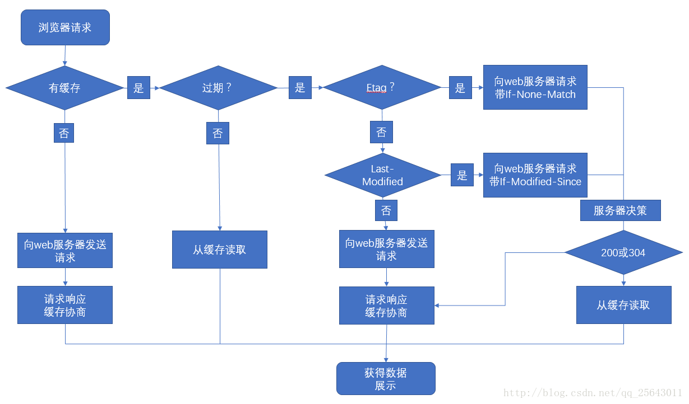

# 浏览器缓存机制



## 目的

浏览器缓存（Browser Caching）是为了节约网络的资源加速浏览，浏览器在用户磁盘上对最近请求过的文档进行存储，当访问者再次请求这个页面时，浏览器就可以从本地磁盘显示文档，这样就可以加速页面的阅览。

## 简单释义

浏览器缓存其实就是浏览器保存通过 HTTP 获取的所有资源, 是浏览器将网络资源存储在本地的一种行为。浏览器的缓存机制是根据 HTTP 报文的缓存标识进行的。

## 策略

通常浏览器缓存策略分为两种， 并且缓存策略都是通过设置 HTTP Header 来实现的：

强缓存和协商缓存是浏览器缓存中的两种不同的机制，用于控制缓存的有效性。

1. 强缓存：强缓存是通过设置响应头部字段来实现的，当浏览器请求一个资源时，会先检查该资源的强缓存是否存在。如果存在，并且没有过期（根据缓存的有效期判断），浏览器直接从本地缓存中获取资源，不发送请求到服务器。常见的强缓存相关的响应头字段有：

- Cache-Control：通过设置 max-age 指令来设置缓存的有效期，单位为秒。例如，Cache-Control: max-age=3600 表示资源在请求后的 3600 秒内可以直接从缓存中获取。
- Expires：通过设置一个具体的过期时间来指定缓存的有效期，是一个 GMT 格式的日期字符串。例如，Expires: Fri, 10 Sep 2021 12:00:00 GMT 表示资源在过期时间之前可以直接从缓存中获取。

2. 协商缓存：当浏览器请求一个资源时，如果该资源的强缓存失效（已过期），浏览器会发送一个请求到服务器，通过协商缓存来判断是否需要返回新的资源。服务器会根据请求头中的条件与资源的标识进行比较，来判断资源是否有更新。常见的协商缓存相关的请求头和响应头字段有：

- If-Modified-Since / Last-Modified：请求头中的 If-Modified-Since 字段表示上次请求时服务器返回的资源的最后修改时间，响应头中的 Last-Modified 字段表示资源的最后修改时间。服务器会将 If-Modified-Since 的值与资源的 Last-Modified 进行比较，如果相同，则返回 304 Not Modified，表示资源没有变化，可以使用缓存的版本。
- If-None-Match / ETag：请求头中的 If-None-Match 字段表示上次请求时服务器返回的资源的唯一标识符，响应头中的 ETag 字段表示资源的唯一标识符。服务器会将 If-None-Match 的值与资源的 ETag 进行比较，如果相同，则返回 304 Not Modified，表示资源没有变化，可以使用缓存的版本。

强缓存和协商缓存可以配合使用，当强缓存失效时，浏览器会发送一个带有协商缓存条件的请求到服务器，通过协商缓存来验证资源的有效性，从而决定是否返回新的资源。这样可以减少不必要的网络传输和服务器的负载，提高系统的性能和用户体验。

### Expires

response header 里的过期时间，浏览器再次加载资源时，如果在这个过期时间内，则命中强制缓存。

### Cache-Control

`Cache-Control` 通用消息头字段，被用于在 http 请求和响应中，通过指定指令来实现缓存机制。缓存指令是单向的，这意味着在请求中设置的指令，不一定被包含在响应中。

> 当客户端发送一个请求时，可以在请求头部中设置一些缓存指令，如 Catch-Control 和 If-None-Match 等。这些指令告诉服务器客户端的缓存策略或者资源的验证方式。
> 然而，服务器并不一定会在响应中包含与请求中相同的缓存指令。服务器会根据自身的配置和资源的特性来确定响应的缓存策略和验证方式。服务器可能会根据资源的类型、大小、敏感性等因素来确定缓存行为。
> 所以，即使客户端在请求中设置了缓存指令，服务器也可能返回与之不同的缓存指令。客户端需要根据响应中的缓存指令来决定如何处理响应，是否缓存响应以及如何使用缓存的版本。
> 因此，客户端和服务器之间的缓存行为是相互独立的，并且需要根据实际情况进行适当的处理和配置。

#### public

表明响应可以被任何对象（包括：发送请求的客户端，代理服务器，等等）缓存，即使是通常不可缓存的内容。（例如：1.该响应没有 max-age 指令或 Expires 消息头；2. 该响应对应的请求方法是 POST 。）

#### private

表明响应只能被单个用户缓存，不能作为共享缓存（即代理服务器不能缓存它）。私有缓存可以缓存响应内容，比如：对应用户的本地浏览器。

#### no-cache

当服务器返回带有 `no-cache` 指令的响应时，表示缓存必须在使用之前先进行验证，即每次请求都要向服务器发送请求来检查缓存的有效性。服务器在响应中会包含一个验证标识（如 `ETag` 或 `Last-Modified`），客户端在下一次请求时会将这个验证标识发送给服务器，服务器根据验证标识来判断是否返回新的内容。如果验证标识匹配，服务器会返回一个特殊的响应状态码 304 Not Modified，表示资源没有变化，客户端可以继续使用缓存的版本。这样可以减少不必要的网络传输，但仍然需要与服务器进行通信来进行缓存验证。

#### no-store

当服务器返回带有 no-store 指令的响应时，表示响应内容不应该被缓存，即每次请求都必须从服务器获取最新的内容。客户端和代理服务器都不应该将响应存储在缓存中，而是直接从服务器获取内容。这样可以确保客户端始终获取到最新的内容，但会增加网络传输的开销。

`no-cache` 指令要求缓存在使用之前进行验证，而 `no-store` 指令要求禁止缓存响应内容。`no-cache` 仍然允许缓存响应，但需要进行缓存验证，而 `no-store` 则完全禁止缓存。

#### max-age=<seconds>

设置缓存存储的最大周期，超过这个时间缓存被认为过期 (单位秒)。与 Expires 相反，时间是相对于请求的时间。

#### s-maxage=<seconds>

覆盖 max-age 或者 Expires 头，但是仅适用于共享缓存 (比如各个代理)，私有缓存会忽略它。

#### max-stale[=<seconds>]

表明客户端愿意接收一个已经过期的资源。可以设置一个可选的秒数，表示响应不能已经过时超过该给定的时间。

#### min-fresh=<seconds>

表示客户端希望获取一个能在指定的秒数内保持其最新状态的响应。

### Expires 和 Cache-Control 的区别

- Expires 是 http1.0 的产物，Cache-Control 是 http1.1 的产物
- 两者同时存在的话，Cache-Control 优先级高于 Expires；
- 在某些不支持 HTTP1.1 的环境下，Expires 就会发挥用处。所以 Expires 其实是过时的产物，现阶段它的存在只是一种兼容性的写法
- Expires 是一个具体的服务器时间，这就导致一个问题，如果客户端时间和服务器时间相差较大，缓存命中与否就不是开发者所期望的。Cache-Control 是一个时间段，控制就比较容易

### 协商缓存

#### ETag 和 If-None-Match

ETag 是一个由服务器生成的用于标识资源版本的字符串。当客户端发送一个请求时，服务器会把 ETag 的值放在响应的头部中返回给客户端。当客户端再次请求同一个资源时，可以通过把之前响应中的 ETag 值放在请求的头部中的 If-None-Match 字段中来告诉服务器，如果资源的 ETag 值没有发生变化，则服务器可以返回一个特殊的响应状态码 304 Not Modified，表示资源没有变化，客户端可以继续使用缓存的版本。

#### Last-Modified 和 If-Modified-Since

`Last-Modified`和`If-Modified-Since`是 HTTP 协议中用于缓存控制的两个相关的头部字段。

1. Last-Modified：当服务器返回一个响应时，可以在响应头部中包含 Last-Modified 字段，该字段表示资源的最后修改时间。例如：

```shell
Last-Modified: Fri, 10 Sep 2021 12:00:00 GMT
```

2. If-Modified-Since：当客户端发送一个请求时，可以在请求头部中包含 If-Modified-Since 字段，该字段的值是一个日期时间，表示客户端上次请求时从服务器获取的资源的最后修改时间。例如：

```shell
If-Modified-Since: Fri, 10 Sep 2021 12:00:00 GMT
```

使用 Last-Modified 和 If-Modified-Since 的组合可以实现缓存验证的功能。当客户端再次请求同一个资源时，可以通过把上次响应中的 Last-Modified 值放在请求的 If-Modified-Since 字段中来告诉服务器，如果资源的最后修改时间没有发生变化，则服务器可以返回一个特殊的响应状态码 304 Not Modified，表示资源没有变化，客户端可以继续使用缓存的版本。

服务器接收到带有 If-Modified-Since 字段的请求后，会将该字段的值与资源的最后修改时间进行比较。如果资源的最后修改时间早于或等于 If-Modified-Since 的值，则表示资源没有变化，服务器会返回 304 Not Modified；如果资源的最后修改时间晚于 If-Modified-Since 的值，则表示资源已经变化，服务器会返回新的响应内容。

通过使用 Last-Modified 和 If-Modified-Since，可以减少不必要的网络传输和服务器的负载，提高系统的性能和用户体验。

#### ETag 和 Last-Modified 区别

- Last-Modified 是基于资源的最后修改时间来验证缓存的有效性，而 ETag 是基于资源的唯一标识符来验证缓存的有效性。
- Last-Modified 精确到秒级别，而 ETag 可以是任意字符串。
- ETag 的优先级高于 Last-Modified，即如果服务器同时返回 ETag 和 Last-Modified，客户端会优先使用 ETag 进行缓存验证。
- ETag 可以在服务器端使用更复杂的算法生成，例如使用文件内容的哈希值，而 Last-Modified 仅仅是文件的最后修改时间。

综上所述，ETag 提供了更精确和灵活的缓存验证机制，而 Last-Modified 则提供了一种简单的基于时间的缓存验证机制。在实际应用中，可以根据具体需求选择适合的缓存验证方式。

## 浏览器缓存过程

1. 浏览器第一次加载资源，服务器返回 200，浏览器将资源文件从服务器上请求下载下来，并把 response header 及该请求的返回时间一并缓存；
2. 下一次加载资源时，先比较当前时间和上一次返回 200 时的时间差，如果没有超过 cache-control 设置的 max-age，则没有过期，命中强缓存，不发请求直接从本地缓存读取该文件（如果浏览器不支持 HTTP1.1，则用 expires 判断是否过期）；如果时间过期，则向服务器发送 header 带有 If-None-Match 和 If-Modified-Since 的请求；
3. 服务器收到请求后，优先根据 Etag 的值判断被请求的文件有没有做修改，Etag 值一致则没有修改，命中协商缓存，返回 304；如果不一致则有改动，直接返回新的资源文件带上新的 Etag 值并返回 200；
4. 如果服务器收到的请求没有 Etag 值，则将 If-Modified-Since 和被请求文件的最后修改时间 Last-Modified 做比对，一致则命中协商缓存，返回 304；不一致则返回新的 Last-Modified 和文件并返回 200；



## 存储位置

浏览器缓存可以存储在不同的位置，包括以下几种：

### Service Worker 缓存

Service Worker 是一种在浏览器背后运行的脚本，可以拦截和处理网络请求。通过使用 Service Worker，开发人员可以将资源存储在浏览器的缓存中，以供离线访问或快速加载。

### 内存缓存

浏览器可以将一部分缓存存储在内存中，这样读取缓存的速度更快。内存缓存对于频繁访问的资源非常有效，但是它的容量有限，一旦浏览器关闭，缓存就会被清空。

### 磁盘缓存

浏览器可以将一部分缓存存储在磁盘上，这样即使浏览器关闭，缓存也可以被保留。磁盘缓存的容量通常比内存缓存大，但是读取速度相对较慢。

### Push Cache

Push Cache 是一种由服务器推送资源到浏览器缓存中的方式。当服务器使用 HTTP/2 的 Server Push 功能主动推送资源时，这些资源会被存储在 Push Cache 中，以备将来使用。

需要注意的是，具体的缓存存储位置和策略可能因浏览器类型、版本和配置而有所不同。不同的缓存位置具有不同的特点和适用场景，开发人员可以根据实际需求和浏览器的支持情况来选择合适的缓存位置。

## 用户行为对浏览器缓存的控制

用户的行为可以对浏览器缓存产生不同的影响，以下是几种常见的用户行为及其对浏览器缓存的控制：

1. 地址栏访问：当用户通过在地址栏输入网址或点击书签等方式访问网页时，浏览器会首先检查该页面的缓存情况。如果存在有效的缓存，则浏览器会直接从缓存中加载页面，不会发送请求到服务器。如果缓存已过期或不存在，则浏览器会发送请求到服务器，获取最新的页面内容。

2. F5 刷新：当用户按下 F5 键或点击浏览器的刷新按钮时，浏览器会忽略缓存，强制重新发送请求到服务器，获取最新的页面内容。这样可以确保浏览器中的页面与服务器上的内容保持一致，适用于需要获取最新数据的情况。

3. Ctrl+F5 刷新：当用户按下 Ctrl 键并同时按下 F5 键时，浏览器会忽略缓存，并发送一个带有 Cache-Control:no-cache 的请求头到服务器。服务器收到这个请求后，会忽略缓存，返回最新的页面内容。与 F5 刷新不同的是，Ctrl+F5 刷新会忽略缓存的有效期，而是直接向服务器请求最新的内容。

总的来说，地址栏访问会根据缓存的有效期来决定是否使用缓存，F5 刷新会忽略缓存，强制重新请求页面，而 Ctrl+F5 刷新会忽略缓存的有效期，直接向服务器请求最新的内容。用户可以根据需要选择合适的刷新方式来控制浏览器缓存的使用。

## 三级缓存原理 (访问缓存优先级)

浏览器读取缓存的位置有一定的优先级顺序，以确定从哪个位置获取资源。一般来说，浏览器的缓存位置优先级从高到低如下：

1. Service Worker 缓存：如果网页注册了 Service Worker 并且已经安装和激活，浏览器会首先检查 Service Worker 缓存，以确定是否有匹配的缓存资源。Service Worker 缓存可以提供离线访问和快速加载的功能。

2. 内存缓存：浏览器会检查内存中的缓存，以确定是否有匹配的资源。内存缓存的读取速度非常快，适用于频繁访问的资源。

3. 磁盘缓存：如果内存缓存中没有找到匹配的资源，浏览器会进一步检查磁盘缓存。磁盘缓存的容量较大，但读取速度相对较慢。

4. Push Cache：Push Cache 是一种由服务器推送资源到浏览器缓存中的方式。浏览器会检查 Push Cache，以确定是否有匹配的资源。Push Cache 的优先级相对较低，因为它是由服务器控制的。

5. 网络请求：如果以上缓存位置都没有找到匹配的资源，浏览器将发送网络请求，从服务器获取最新的资源。
